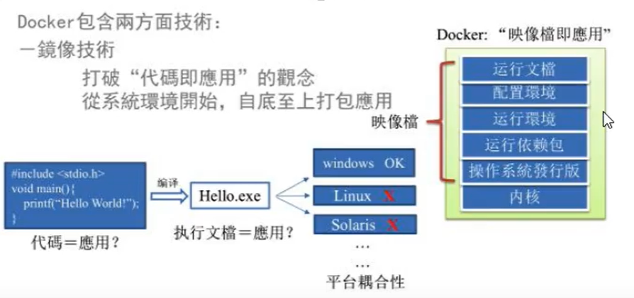
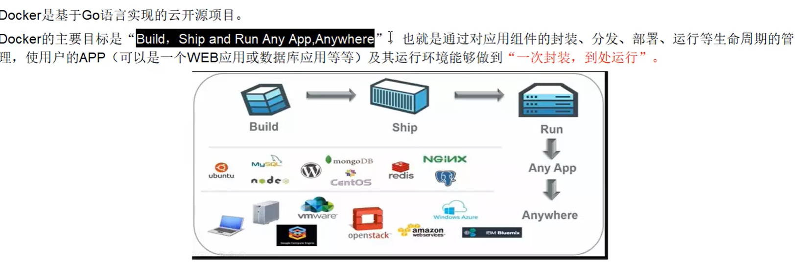
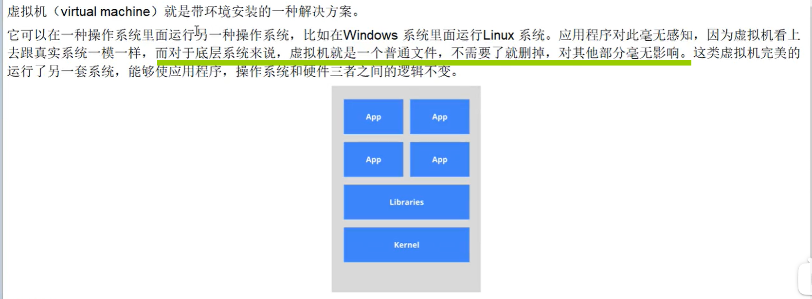

# Docker Study Note

容器虚拟化技术

- [Docker Study Note 1](#docker-study-note-1)
  - [为什么](#为什么)
    - [Docker 理念](#docker理念)
  - [Docker 作用](#docker作用)
    - [容器虚拟化技术：Linux 容器](#容器虚拟化技术linux容器)

# 为什么

解决了运行环境&配置问题的软件容器，方便做 CI 并有助于整体发布的容器虚拟化技术

- 环境&配置
- docker 打包代码/配置/系统/数据

🍊 软件带环境安装？

- 安装的时候，把原始环境一摸一样的复制过来

---

docker 包含两方面技术

1.镜像技术

- 从系统环境开始，自底至上打包整个项目



# Docker 理念



- 假如 4 个服务，4 个镜像，构建成 1 份用于 docker 安装

# Docker 作用 & 底层原理

==之前的虚拟机技术==


- 占用资源大
- 启动慢
- 冗余步骤多
- 虚拟一套硬件
- 客户端相当于本机命令

==docker vs 以前技术==


## 容器虚拟化技术：Linux 容器

容器虚拟化技术 - **Linux 容器（Linux Containers）**

- 改善普通虚拟机的缺点，
- ==不是模拟一个完整的 os，而是对进程进行隔离==
  - 内核部分精简，其他不相关部分省去
  - 有了容器，可以将软件运行所需的所有资源打包到一个隔离的容器中
- <font color="red">容器内的应用进程直接运行在宿主的内核中</font>，自己本身没有内核，也没有对硬件虚拟
  - 所以比传统虚拟机更轻便
- ==每个容器之间相互隔离，有自己的文件系统==
  - 容器之间进程不会相互影响，能区分计算资源

# 镜像原理

> 镜像是一种轻量级, 可执行的独立软件包，**用于打包软件运行环境和基于运行环境开发的软件**它包含运行某个软件所需的所有内容。（代码，运行时，库，环境变量，配置文件）

:grey_question:为什么镜像采用这种分层结构?

* **共享资源**
  * 如多个镜像从相同base镜像构建而来，那么宿主机只需在磁盘上保存一份base镜像。内存中只需加载一份base镜像，就可以为所有容器服务，而且镜像的每层都可以被共享

## UnionFS: 联合文件系统


镜像实质

* 对文件系统的修改作为一次提交，一层层叠加
* 特性: 一次同时加载多个文件系统，（对外一个）

## 镜像加载原理


# Docker 基本组成

## Docker 架构图：镜像、容器、仓库


==docker 本身是一个容器运行载体，管理引擎（daemon 线程）==

**镜像 Image**

- 只读的==模板==，镜像可以用来创建 docker 容器
- <font color="red">同一个镜像可以创建很多容器</font>

**容器 Container**

- docker 利用容器独立运行的一个或一组应用
- 镜像创建的运行实例，<u>一个容器运行一种服务</u>
- <font color="red">可以把容器看作一个简易版 Linux 环境</font>
  - 如 centos 镜像，内核，仅占 170M

**仓库 Repository**

- 存放镜像文件的场所
- 与==仓库注册服务器(Registry)==有区别。
  - Registry 上往往存放着多个仓库，每个仓库中又包含多个镜像，每个镜像有不同标签（tag）
- **分类**
  - 公开仓库 - Docker Hub（最大）
  - 私有仓库

# docker run


> 由于本地没有`hello-world`镜像，所以先下载一个并在容器内运行

`docker run` 以一个镜像为模板，创建这个镜像的容器

- 默认 `docker run image_name:latest`， latest 标签可省略

# 常用命令速查


# 帮助命令

## docker version：查看版本


## docker info: 查看信息

比 `docker version` 更完整


## docker --help

# 镜像命令

## docker images

> docker images
>
> - 列出本地镜像


此时能运行的本地镜像只有 `hello-world`

---


- ==REPOSITORY==镜像仓库源
- ==TAG==镜像标签
- ==IMAGE ID==镜像 ID
- ==CREATED==镜像创建时间
- ==SIZE==镜像大小

---

**选项**

- `docker images -a` 列出所有本地镜像，==包含中间镜像==
- `docker images -q` 查看当前所有本地镜像的==id==
  - `docker images -qa` 查看当前所有本地镜像的镜像 id （包含中间镜像）
- `docker images --digests` 显示镜像摘要信息
- `docker images --no-trunc` 显示镜像完整信息，可以看见完整 id

## docker search

> 搜索某个镜像名字 - hub.docker.com


**选项**

- `docker search -s` 指定 star 数，筛选镜像
  - `dockeer search -s 30 tomcat` 筛选 start 数>30 的 tomcat
- `docker search --no-trunc` 显示镜像完整信息

## docker pull

```bash
docker pull <image_name>:<TAG>
```

拉取镜像

- <font color="red">不写`TAG`默认为`latest`</font>

## docker rmi

```bash
docker rmi <image_name>:<TAG>
```

删除镜像

- 不写`TAG`默认为`latest`

**选项**

- `docker rmi -f` 强制删除
- `docker rmi <image_id/name>` 删除单个特定镜像（通过镜像 id/name 指定）
- `docker rmi <image_id/name>:<TAG> <image_id/name>:<TAG>` 删除多个镜像
- `docker rmi -f $(docker images -qa)`删除全部本地镜像
  - `docker images -qa` 列出当前所有本地镜像 id（包括中间镜像）

# 容器命令

## 新建并启动容器: docker run IMAGE

```bash
docker run [OPTIONS] IMAGE [COMMAND][ARG...]
```

- (根据某镜像)**新建**并**启动**容器

**OPTIONS**说明


- `--name=""`为容器指定名称
  - 如果不指定会随机分配一个默认容器名
  - `docker run -it --name mycentos centos`
- `-d`**后台运行容，并返回容器 ID**
  - <font color="red">启动守护式容器</font>
- `-i`**以交互模式运行容器，通常与`-t`同时使用**
- `-t`**为容器重新分配一个伪输入终端，**
- `-P`随机端口映射
- `-p`指定端口映射，以下四种格式
  - `ip:hostPort:containerPort`
  - `ip::containerPort`
  - `hostPort:containerPort`
  - `containerPort`

**前台模式**

- `docker run -it`

### 启动守护式容器：docker run -d

相当于以**后台模式**启动一个容器

- `docker ps`查询，会显示该容器已经退出
- <font color="red">docker 容器后台运行，必须有一个前台进程</font>
  - 容器运行的命令如果不是一直挂起的命令（如`top`，`tail`）是会自动退出的

## 查看正在运行的容器：docker ps

> 查看正在运行的所有容器
>
> docker ps

**选项**


- `docker ps -l`
  - 列出最近创建的容器
- `docker ps -n 3`
  - 列出上 3 次运行的容器
  - 显示最近 n 个创建的容器
- `docker ps -lq`
  - 静默模式, 只显示最近创建容器的编号
- `docker ps --no-trunc`
  - 不截断输出

## 查看容器内进程: docker top

`docker top <container_id/name>`

注意可以把容器看作是一个简版的 linux 环境

## 查看容器内部细节： docker inspect

`docker inspect <container_id/name>`

## 退出容器：exit & ctrl+P+Q

`exit`

- 容器停止退出

`ctrl+P+Q`

- 容器不停止退出

## 进入正在运行的容器并以命令行交互：docker exec -it

在容器中打开新的终端，并且可以启动新的进程

- `docker exec -it <container_id>`
  - `docker exec -t id ls -l /tmp`不会直接进入容器，但是会返回执行结果
  - `docker exec -t id /bin/bash`会进去容器 bash 终端，类似`docker attach`

直接进入容器启动命令的终端，不会重新启动

- `docker attach <container_id>`

## 启动& 重启容器: docker start/restart

`docker start <container_id/name>`

- 启动（关闭了的）容器

`docker restart <container_id/name>`

- 重启容器

## 停止容器: docker stop/kill

`docker stop <container_id/name>`

- 普通慢慢停止容器

`docker kill <container_id/name>`

- 强制停止容器

## 删除已停止的容器:docker rm

`docker rm <container_id>`

- 删除已停止的容器
- 强制删除
  - `docker rm -f`

`docker rm -f $(docker ps -a -q)`

- 一次删除多个容器

`docker ps -aq | xargs docker rm`

- 一次删除多个容器

## 查看容器日志: docker logs

`docker logs -f -t --tail <container_id>`

- `-t` 加入时间戳
- `-f` 跟随最新的日志打印
- `--tail` 数字 显示最后多少条


## 拷贝容器文件至主机: docker cp

`docker cp <container_path> <host_path>`

## 提交容器: docker commit

`docker commit`

* 提交容器副本使之成为一个新镜像
* `docker commit -m -a`
  * `-m`提交描述信息
  * `-a`作者

如，对当前运行的容器进行了修改，之后对其进行提交，成为新镜像