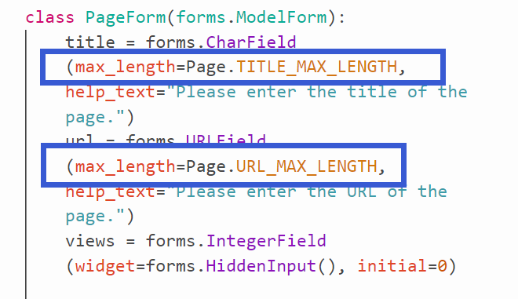
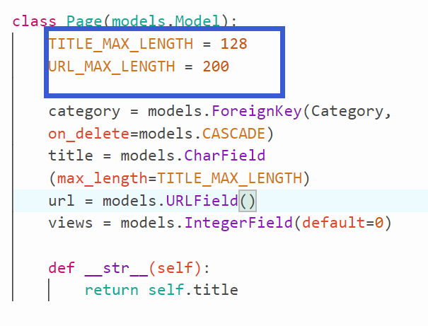
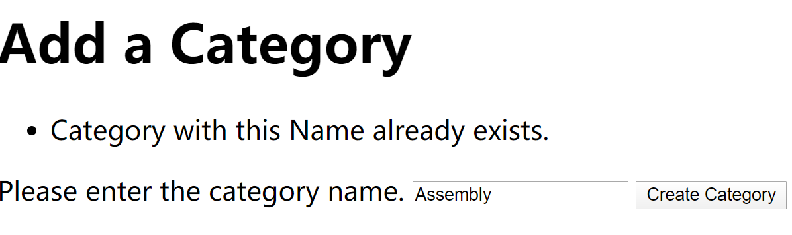

# 表单

从user获取新 categories & pages

本章学习如何从web 表单中获取返回值，提交值

- django有 ``Django's documentation on forms``机制可以进行收集user info & save to the database .
  - 自动生成HTML 表单 ``form widgets``
  
  - 根据validation机制chekc上传的data
  - 针对validation error, redisplay表单
  
  - 将提交的表单data转化为python data types

  - **优点**: 减少处理HTML表单的时间

---
:speech_balloon: **GET & POST相关**

- GET : **针对特定资源的HttpRequest访问请求**, 通过 ``GET`` 可检索特定特定资源
- POST : **客户端浏览器上传的等待处理data.** 可剖析成服务器新资源(一般地,存储在数据库内)

:speech_balloon: **reverse()**

```python
return redirect(reverse('rango:show_category',kwargs={'category_name_slug':category_name_slug}))
```

- 结合``redirect()`` & ``reverse()``使用

- ``reverse()``先查找 urls.py 中对应``URLPatterns``

  - 此例 path ``name= rango:show_category``

- 匹配后返回完整``URL``
  - 此例有附加参数``category_name_slug``，将该参数传给``kwargs`` 完成完整的``URL``

---

## Workflow

1. 在**Django app目录**下创建 forms.py用于存储表单相关类
    <font color='red'>也可以选择将forms定义在models.py中</font>

2. 为每个**用于表单的Model**创建 ``ModelForm``类
   - 此函数用于为已存在model创建Django表单
3. 自定义表单(可选)
4. 创建/更新 **view处理表单**
   1. display表单
   2. 保存表单数据
   3. **flagging up errors**[when user enters incorrect data(or no data at all)in the form.]

5. **创建/更新模板**显示表单

6. **URL->VIEW**映射

---
> forms.py

:speech_balloon: **避免模型&表单``MAX_LENGTH``属性重复**

- 在模型中为``MAX_LENGTH``存储变量,需要时再调用

- 

- 

---

```python
from django import forms
from rango.models import Page, Category

class CategoryForm(forms.ModelForm):
    name = forms.CharField(max_length=128,help_text="Please enter the category name.")
    views = forms.IntegerField(widget=forms.HiddenInput(,initial=0))
    likes = forms.IntegerField(widget=forms.HiddenInput(,initial=0))
    slug = forms.CharField(widget=forms.HiddenInput(),required=False)

    # An inline class to provide additional information on the form
    class Meta:
        # Provide an relation bet ModelForm and a model
        # recv user defined category name
        model = Category
        fields = ('name',)

class PageForm(forms.ModelForm):
    title = forms.CharField(max_length=128,help_text="Please enter the title of the page.")
    url = forms.URLField(max_length=200,help_text="Please enter the URL of the page.")
    views = forms.IntegerField(widget=forms.HiddenInput(), initial=0)

    class Meta:
        # Provide association
        model = Page


        # what fields do we want to include in our form?
        # This way we donot need each field in the model.
        # some may allow NULL values, we donot want to include NULL

        # here we hiding the FK
        # we can either exclude the category field from the form
        exclude = ('category',)

        # or specify the fields to include('donot include the categoty field')
        # here display 3 attr in the form
        # fields =('title','url','views')
```

### 表单字段定义

---

- **Class Meta**中建立model与表单的关系(在表单中存储&显示data), 该类同时会帮助处理error

需要定义 ``fields``变量用于指定表单中内容

``exldue``变量用于排除显示在表单内内容

---

以上**forms.CharField, forms.URLFiedl**会为用户提供输入框 **text entry**.

- **IntergerField可选字段**

  - **widget=forms.HiddenInput()** 隐藏该字段，使用户无法输入,**表示该字段将不会在表单中显示**
    - *注意即使隐藏该字段，还是需要在Form中定义, 因为field会调用view(),如没找到相应字段会返回0*
  
  - **initial=0**，初始值为0

---
除了以上, Django还提供 ``EmailField`` ``ChoiceField`` ``DateField`` 等, 都已经包括了 ***error checking机制***

:speech_balloon: **Error Checking 机制**

- django表单内置**处理空值,错值POST**的机制
  
- 处理已经存在的``name``相同Category
  
  - 

- 不填写字段会提示

:speech_balloon: **URL Checking**

- page模型的url字段类型为``URLField``类型, django需要正确``URLField``类型
  
- 解决用户**非正确url**输入问题
  
  - forms.py 中改写 ``clean()``方法(继承于``ModelForm``)

- ``clean()``在data存入数据库之前, 提供 logical place 以便 verify&fix **任何用户input表单数据**

```python
    #此处为Page的url字段覆写clean方法
   def clean(self):
        #ModelForm类的cleaned_data变量用于获取表单数据
        cleaned_data = self.cleaned_data
        url = cleaned_data.get('url')

        # If url is not empty & donot start with 'http://'
        #then prepend 'http://'
        if url and not url.startswith('http://'):
            url = f'http://{url}'
            cleaned_data['url'] = url

        return cleaned_data
```

- 以上解决了如何在存入数据库前clean表单数据

---

### 结合表单更改模板

```html
<!DOCTYPE html>
<html>
<head>
    <title>Rango</title>
</head>

<body>
    <h1>Add a Category</h1>
    <div>
        <form id="category_form" action="/rango/add_catrgory/" method="post">
            
            
                {{ hidden }}
            

            
                {{ field.errors }}
                {{ field.help_text }}
                {{ field }}
            
            <input type="submit" name="submit" value="Create Category" />
        </form>
    </div>
</body>
</html>
```

:speech_balloon: **注意``body``tag中新加了``form``tag**

- 可以通过``POST``request查看表单内所有被提交至``URL``的data

:speech_balloon: **Cross Site Request Forgery Tokens**

- > {\% csrf_token \%}

- 用于保护提交表单时的HTTP``POST``请求

- Django框架要求 ``CSRF token``
  - 如未提供, 用户提交表单时可能出现error

---
