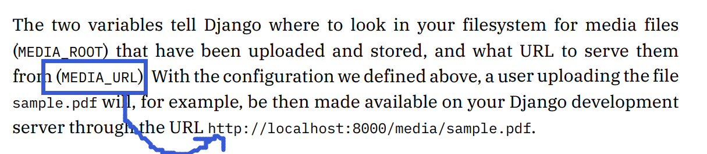

#   Django Workflows


---

##  新建django project
> 运行 ``python django-admin.py startproject <name>``

##  新建django app
>每个项目可以有多个app
>> - 运行 `` python manage.py startapp <appname>``
>> - 把新建app加入 ``settings.py``文件中的 ``INSTALLED_APPS``数组中   
>> - 建立项目目录的 ``urls.py`` 到 app目录的 ``urls.py`` 的索引
>>  -    使用include()函数完成
>> - 为app目录创建`` urls.py``，完成基本映射对
>> - 修改app目录下的``views.py``文件,返回基本HttpResponse()对象    

---
##  Template Tag
> ```` 形式

##  静态文件处理 static (media) files
>静态media文件可看为app上部署的不会改变的重要文件
>>**然而时常需要动态地存储这些资源media (文件可能被用户/管理者上传或变更)**

>如何结合templates & views

>>
```

```
提示**django模板引擎**会在template中使用静态文件

- 该段代码使我们能够访问 static目录下的资源 [通过static **template tag**]
- ```
  
  原理= 调用 static 会结合settings.py文件中配置的 STATIC_URL 路径 & url(相对路径))
-   即 url = /static/images/rango.jpg
-   static = STATIC_URL
-  ```html
    >

---
```
 - static template tag可用于任意想放置静态文件的地方, 支持多格式   
```
>   如css, js, 等文件
-   核心是链接 url与STATIC_URL(服务器上root)

---
### (动态)media files 处理
> 修改 settings.py文件
> 
>  (尽量靠近top在BASE_DIR,TEPLATE_DIR,STATIC_DIR附近,
> 
> 便于后期变更path需要)
>
     MEDIA_DIR = os.path.join(BASE_DIR, 'media')
>空白位置加入,用于tempalte tag等url索引 
```
MEDIA_ROOT = MEDIA_DIR
MEDIA_URL = '/media/'
```
> **DIR用于本地客户端访问静态动态文件位置**
> **URL用于服务器上访问静态动态文件位置**


>   如此时，用户上传`sample.pdf`文件，

>   可以在服务器中 通过**MEDIA_URL**设置的path响应相应的请求访问media资源的url请求

>   一般地, 很难处理对MEDIA_URL PATH的引用 (**当出现需要对上传的文件进行引用时**)
-   django框架提供了 ***template context processor*** 服务便于处理
  
    -  修改settings.py中 TEMPLATES列表中 'context_processors' 的值 
>   