# JDK8

新特性

* **lambda**
* **stream**
  * collection
* 接口增强
  * 默认方法`default`&静态方法
* 并行数组排序
* Optional避免`null`检查
* 时间日期API
  * 支持并发
* 可重复注解

- [JDK8](#jdk8)
  - [Lambda](#lambda)
    - [standard format](#standard-format)
    - [省略格式](#省略格式)
      - [Example: Comparator](#example-comparator)
    - [改写Lambda前提条件](#改写lambda前提条件)
    - [实现原理](#实现原理)
    - [对比匿名内部类](#对比匿名内部类)
    - [常用内置函数式接口](#常用内置函数式接口)
      - [Supplier: get()](#supplier-get)
      - [Consumer: accept(T t) & andThen(Consumer<T> after)](#consumer-acceptt-t--andthenconsumert-after)
        - [BiConsumer<T, U>: accept(T,U)](#biconsumert-u-accepttu)
      - [Function<T, R>: apply(T t) & andThen(Function)](#functiont-r-applyt-t--andthenfunction)
        - [BiFunction<T,U,R>](#bifunctiontur)
        - [BinaryOperator<T>](#binaryoperatort)
      - [Predicate: test(T)](#predicate-testt)
        - [and(Predicate<? super T>)](#andpredicate-super-t)
        - [or(Predicate<? super T>)](#orpredicate-super-t)
        - [negate()](#negate)
  - [interface](#interface)
    - [默认方法](#默认方法)
    - [静态方法](#静态方法)
  - [方法引用](#方法引用)
      - [使用前提](#使用前提)
    - [instanceName::instanceMethod](#instancenameinstancemethod)
    - [className::staticMethod](#classnamestaticmethod)
    - [className::instanceMethod](#classnameinstancemethod)
    - [className::new](#classnamenew)
    - [type[]::new(#typenew)
  - [Stream](#stream)
    - [获取流的方式](#获取流的方式)
    - [注意事项(*)](#注意事项)
    - [常用方法](#常用方法)
      - [forEach(Consumer<? super T>)](#foreachconsumer-super-t)
      - [count()](#count)
      - [filter(Predicate<? super T>)](#filterpredicate-super-t)
      - [limit(long maxSize)](#limitlong-maxsize)
      - [skip(long n)](#skiplong-n)
      - [map(Fucntion<? super T, ? extends R> mapper)](#mapfucntion-super-t--extends-r-mapper)
      - [sorted(Comparator<? super T>) & sorted()](#sortedcomparator-super-t--sorted)
      - [distinct()](#distinct)
      - [match](#match)
      - [findFirst() & findAny()](#findfirst--findany)
      - [max(Comparator) & min(Comparator)](#maxcomparator--mincomparator)
      - [(*) reduce(T, BinaryOperator)](#-reducet-binaryoperator)
      - [map & reduce](#map--reduce)
      - [mapToInt(ToIntFunction)](#maptointtointfunction)
      - [Stream.concat](#streamconcat)
    - [收集Stream流中的结果](#收集stream流中的结果)
      - [数据收集至集合: collect()](#数据收集至集合-collect)
      - [数据收集至数组: toArray()](#数据收集至数组-toarray)
      - [聚合计算收集流数据](#聚合计算收集流数据)
      - [流数据分组](#流数据分组)
        - [多级分组](#多级分组)
      - [流数据分区](#流数据分区)
      - [流数据拼接](#流数据拼接)
    - [range() & rangeClosed()](#range--rangeclosed)
    - [Parallel Stream](#parallel-stream)
      - [获取并行Stream](#获取并行stream)
      - [并行流: 线程安全](#并行流-线程安全)
      - [并行流: 实现原理 Fork/Join](#并行流-实现原理-forkjoin)
        - [Fork/Join原理: 分治法 & 工作窃取法](#forkjoin原理-分治法--工作窃取法)
  - [Optional](#optional)
    - [创建方式](#创建方式)
    - [常用方法](#常用方法-1)
  - [新日期&时间API](#新日期时间api)
    - [LocalDate](#localdate)
    - [LocalTime](#localtime)
    - [LocalDateTime](#localdatetime)
    - [共通方法：修改时间](#共通方法修改时间)
    - [DateTimeFormatter: 时间格式化 & 解析](#datetimeformatter-时间格式化--解析)
    - [Instant: 时间戳](#instant-时间戳)
    - [Duration/Period: 日期时间差类](#durationperiod-日期时间差类)
    - [TemporalAdjuster(s): 时间校正器](#temporaladjusters-时间校正器)
    - [ZonedDate(Time):设置时区](#zoneddatetime设置时区)
  - [重复注解 & 类型注解](#重复注解--类型注解)

## Lambda

对比匿名内部类

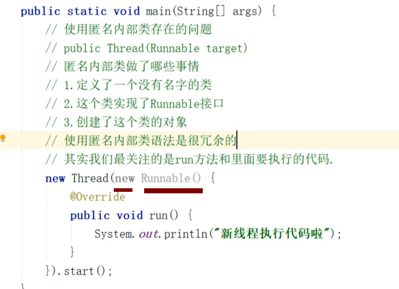

* 语法冗余，有时候可读性差

lambda是一个匿名函数

* 只需要将要执行的代码放入lambda表达式中
* **简化匿名内部类**

```java
new Thread(() ->{
    System.out.println("Lambda表达式执行了");
}).start();
```

### standard format

🍊 lambda标准格式

> lambda表达式**匿名函数**，相当于方法

* 看到**方法的传参指定接口**，可以考虑用lambda表达式
  * <font color="red">不能替换所有匿名内部类</font> 

```java
(参数列表) -> {
    // method body
}
```

* 无参无返回
  * lambda负责对接口中抽象方法的重写

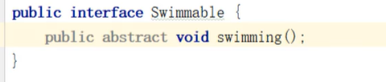
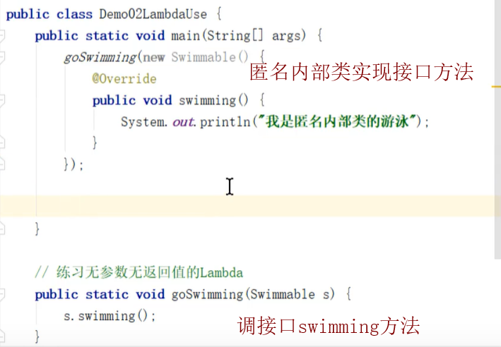

```java
// lambda表达式主要负责重写方法
// 无参无返回
goSwimming(() ->{
    System.out.println("");
});
```

* 有参有返回

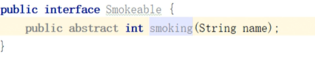
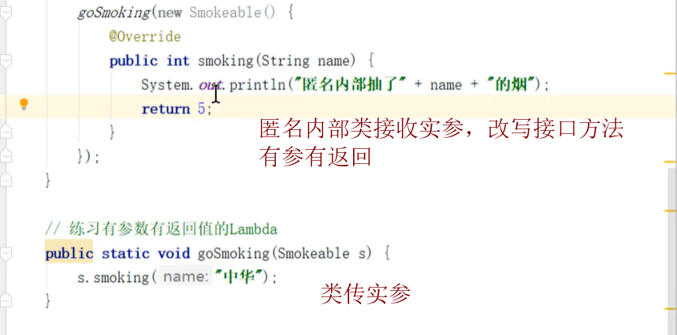

```java
goSmoking((String name)->{
  System.out.println("lambda抽了"+name+“的烟”);
  return 6;
})
```

### 省略格式

🍊 开发中一般使用省略格式，规则

* 小括号内参数**类型可省**
* 小括号内**仅有1个参数，小括号可省略**
* 大括号**仅有1个语句，可省大括号，return，分号**

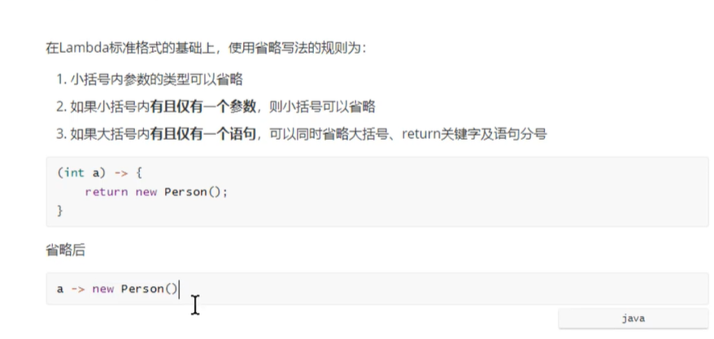

#### Example: Comparator

Comparator的匿名内部类&lambda实现
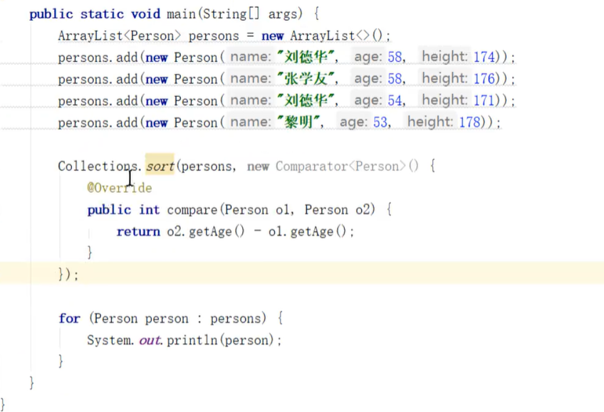

```java
  Collcetions.sort(person, (Person o1, Person o2)->{
  return o2.getAge() - o1.getAge();
})

```

```java
/* 省略写法 */
  Collcetions.sort(person, (o1, o2)-> o2.getAge() - o1.getAge());
  /* for each 省略
  for(Person t:persons){
    System.out.println(t);
  }
  */
  persons.forEach(t-> System.out.println(t));
```

### 改写Lambda前提条件

🍊 使用前提

* **方法的参数/局部变量类型**为**接口**
* 接口中**仅有1个抽象方法**
  * <font color="red">JDK8中只有1个抽象方法的接口称为函数式接口</font>，可以使用lambda
  * 可以用`@FunctionalInterface`注解检测接口是不是只有1个抽象方法

### 实现原理

🍬 小结

* 匿名类编译时产生`class`文件
* lambda运行时生成一个**类**
  * 类中新增一个静态方法，方法体为lambda表达式中代码
  * 还会生成一个匿名内部类，实现接口，重写抽象方法。在重写方法中，调用上步静态方法

🍊 匿名内部类反编译

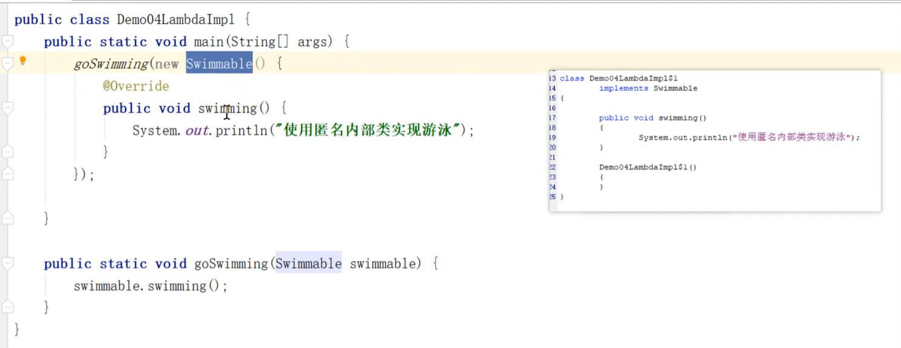

* 形成新的类，`$`

🍊 Lambda反编译

* 通过jdk自带的`javap`对字节码进行反编译
* `javap -c -p filename.class`
  * `-c`对代码进行反汇编
  * `-p`显示所有类和成员

* lambda会在类中新生成一个私有的静态方法，代码**运行时**会放到这个新增的方法中
  * 即，lambda**运行时**会生成一个匿名内部类，同样实现接口。只不过调用静态的方法
  * 

```java
/* 因为在main()中使用了lambda，所以带有$main
因为第一个所以，$0
 */
private statoc void lambda$main$0(){
  System.out.println("lambda表达式中的");
}
```

### 对比匿名内部类

🍊 了解lambda和匿名内部类使用上的区别

1. 所需类型不同

* 匿名内部类可以应用于
  * 类
  * 抽象类
  * 接口
* lambda必须应用于
  * 接口

2. 抽象方法数量不一样

* 匿名内部类所需的接口中抽象方法数量随意
* lambda接口只能有1个抽象方法

3. 实现原理不同

* 匿名内部类编译后形成`class`文件
* lambda运行时动态生成`class`

🍬 小结

* 当接口中只有1个抽象方法时，建议使用lambda
* 其他情况使用匿名内部类

### 常用内置函数式接口

> 只有一个抽象方法定义的接口，函数式接口

* 主要在`java.util.function`包中
* `Supplier<T>`供给型接口
  * 无参有返回值
* `Consumer<T>`消费型接口
  * 接收不返回
* `Function<T,R>`
  * 接收一个参数，返回一个参数
* `Predicate<T>`

#### Supplier: get()

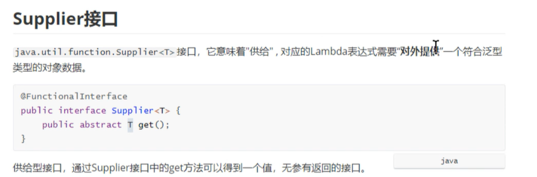

供给型接口，**数据类型由泛型指定**,**无参有返回**

```java
public interface Supplier<T>{
  T get();
}
```

---

🍊 使用lambda表达式返回数组元素最大值

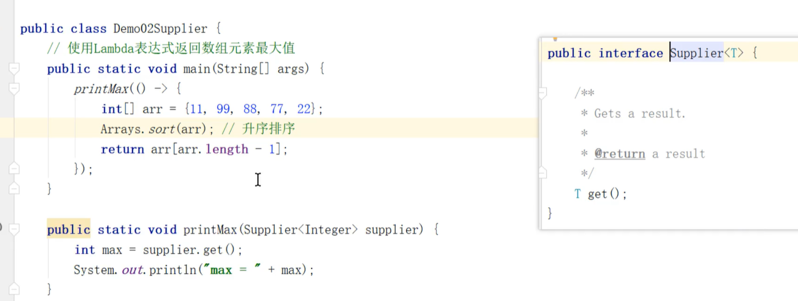

```java
/* 匿名内部类方式 */
Supplier s = new Supplier(){
  @Override
  get(){
    int[] arr = {11,99,88};
    Arrays.sort(arr);
    return arr[arr.length-1];
  }
}
s.get();

/* lambda方式（不定义调用方法情况下可读性差，底层运行时创建匿名内部类，通过接口引用） */
Supplier s = ()->{
  int[] arr = {11,99,88};
  Arrays.sort(arr);
  return arr[arr.length-1];
});
s.get();
```

#### Consumer: accept(T t) & andThen(Consumer<T> after)

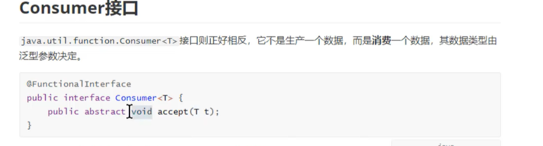

消费型接口，**数据类型由泛型指定**，**无返回值**

🍬 <font color="red">注意Consumer接口中定义的另一个`default`方法</font>

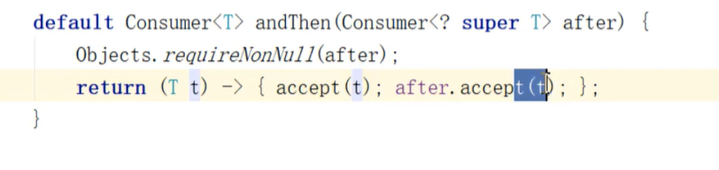

* 通配符指定范围`T`及其父类
* 为Consumer传入另外的Consumer
  * 操作同一个对象`t`
  * 先后执行`accept(t)`
* <font color="red">推荐在一个方法参数和返回值都为`Consumer`类型时，结合使用。会返回一个新的`Consumer`</font>

🍊 使用lambda将一个字符串转成大，小写字符串

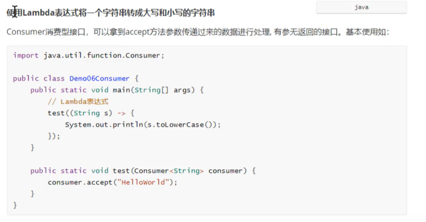

```java
/* 匿名内部类写法 */
Consumer<String> c = new Consumer<String>(){
  @Override
  accept(String str){
    System.out.println(str.toUpperCase());
  }
}
c.accept("Hello World");
/* lambda（直接写，引用，可读性差） */
Consumer<String> c= (str)->System.out.println(str.toUpperCase()));
c.accept("Hello World");
Consumer<String> c2 = (str)->System.out.println(str.toLowerCase()));
```

```java
public static void main(String args[]){
  /* lambda 通过外部方法调用，可读性稍微好*/
  printHello((str)-> System.out.println(str.toUpperCase()),
  (str)-> System.out.println(str.toLowerCase())); //lamba重写Consumer的accpet方法，泛型指定为String，传入printHello方法

  /* anonymous class */
  printHello(new Consumer<String>(){
    @Override
    void accept(String str){
      System.out.println(str.toUpperCase());
    }
  }), new Consumer<String>(){
    @Override
    void accept(String str){
      System.out.println(str.toLowerCase());
    }
  }
}

public void printHello(Consumer<String> c1, Consumer<String> c2){
  c1.accept("Hello World");
  c2.accept("Hello World");
}
```

🍊 使用`andThen`

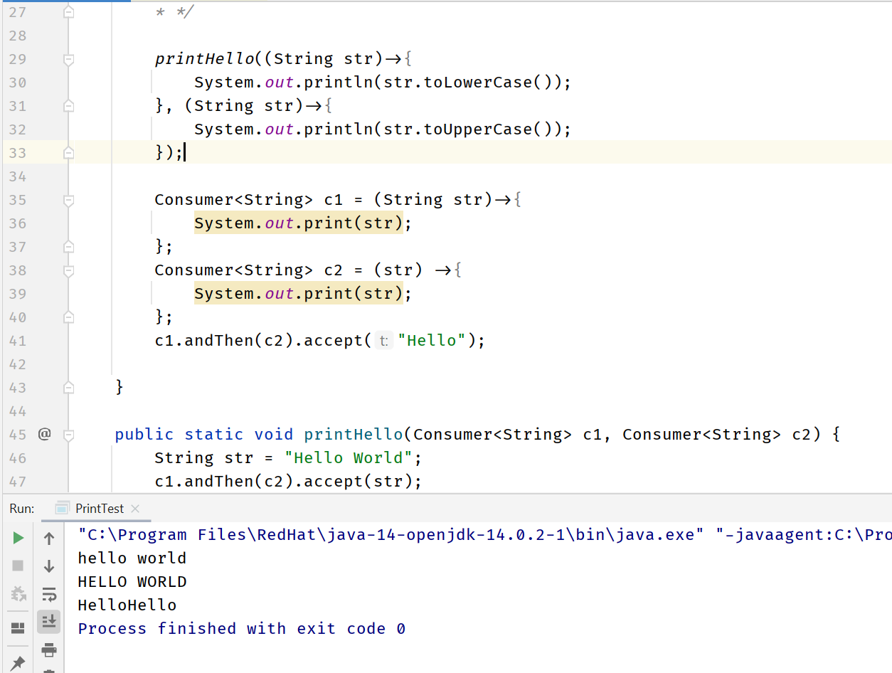

```java
public void printHello(Consumer<String> c1, Consumer<String> c2){
  c1.andThen(c2).accept("Hello World"); // 结合后，先执行c1.accept(str)后执行c2.accept(str)
}
```

##### BiConsumer<T, U>: accept(T,U)

🍊 jdk8,map集合支持`forEach(BiConsumer<T,U>)`


* 无返回值

#### Function<T, R>: apply(T t) & andThen(Function)

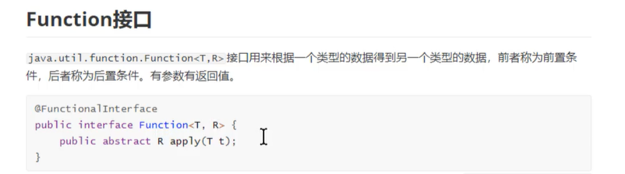

* 接受一个`T`，返回一个`R`

```java
@FunctionalInterface
public interface Function<T, R> {

    /**
     * Applies this function to the given argument.
     *
     * @param t the function argument
     * @return the function result
     */
    R apply(T t);
```

🍊 lambda将字符串转成数字

```java
/* 直接使用lambda重写，底层运行时期形成内部类，并通过Function引用，调用apply方法 */
Function<String, Integer> f = (str)->{
    return Integer.valueOf(str);
};
int num = f.apply("123");
System.out.print(num);
```

```java
/* 外部方法调用 */
public static void main(String args[]){
  convert((String str)->{
    return Integer.valueOf(str);
  });
}

public static void convert(Function<String, Integer> fucntion) {
    int num = fucntion.apply("123");
    System.out.print(num);
}
```

🍊 `andThen`结合使用，返回一个结合的`Function<T,V>`,先后执行apply

* 注意后一个Function接收的值必须为前一个Function<T,R>的返回值`? super R`

```java
default <V> Function<T, V> andThen(Function<? super R, ? extends V> after) {
    Objects.requireNonNull(after);
    return (T t) -> after.apply(apply(t));
}
```

```java
Function<String, Integer> f = (str)-> Integer.valueOf(str);
Function<Integer, Integer> f2 = (i) -> i*5;
int num = f.andThen(f2).apply("123");
System.out.print(num);
```

##### BiFunction<T,U,R>

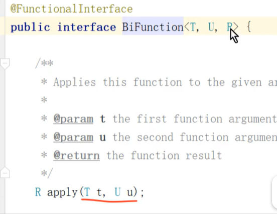

* 接收2个参数，返回1个值

```java
/* 等价 */
BiFunction<String, Integer, String> f2 = (String str, Integer i)-> str.substring(i);
BiFunction<String, Integer, String> f = String::subString;
String result = f.apply("hello world",3);
```

##### BinaryOperator<T>

继承`BiFunction<T,T,T>`

* 传入T&T,返回T

#### Predicate: test(T)

🍊 判断测试接口，接收一个`T`，返回一个`boolean`

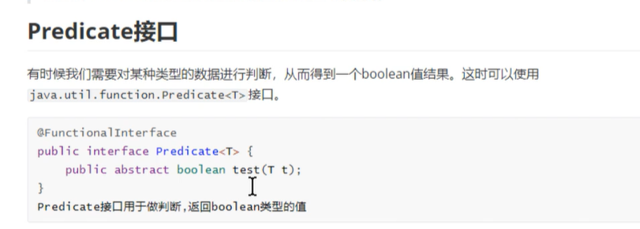

```java
/**
 * Evaluates this predicate on the given argument.
 *
 * @param t the input argument
 * @return {@code true} if the input argument matches the predicate,
 * otherwise {@code false}
 */
boolean test(T t);
```

🍊 lambda判断人名，超过3个字为长名

```java
public static void main(String[] args) {
    isLongName(str->{
        if (str.length()>3) return true;
        else return false;
    });
}

public static void isLongName(Predicate<String> p) {
    boolean flag = p.test("Admin");
    if (flag) System.out.print("长名");
    else System.out.println("短名");
}
```

```java
Predicate<String> p = str->{
    if (str.length()>3) return true;
    else return false;
};
if(p.test("ab")) System.out.println("长名");
else System.out.print("短名");
```

##### and(Predicate<? super T>)

🍊 `and()`泛型必须为调用`Predicate<T>`的本身及其父类

* 返回新`Predicate<T>`
* 两个Predicate做短路与`&&`运算

```java
public static void main(String[] args) {
    Predicate<String> p1 = (String str)->{
        return str.contains("H");
    };
    Predicate<String> p2 = (String str)->{
        return str.contains("W");
    };
    boolean flag = p1.and(p2).test("Hello World");
    if(flag==true) System.out.print("H & W in the string");
}
```

##### or(Predicate<? super T>)

🍊 `or()`泛型必须为调用`Predicate<T>`的本身及其父类

* 返回新`Predicate<T>`
* 两个Predicate做短路或`||`运算

```java
default Predicate<T> or(Predicate<? super T> other) {
    Objects.requireNonNull(other);
    return (t) -> test(t) || other.test(t);
}
```

```java
public static void main(String[] args) {
    check(str->{
        return str.contains("H");
    },str->str.contains("W"));
}

public static void check(Predicate<String> p, Predicate<String> p2) {
    boolean flag = p.or(p2).test("Hello World");
    if (flag){
        System.out.print("Contains H or W");
    }
}
```

##### negate()

🍊 取反

```java
default Predicate<T> negate() {
  return (t) -> !test(t);
}
```

## interface

jdk8接口增强，新增两个方法（之前只能存在抽象方法，**不利于接口扩展，如改接口，所有实现都需要改**）

* 默认方法
* **静态方法**

### 默认方法

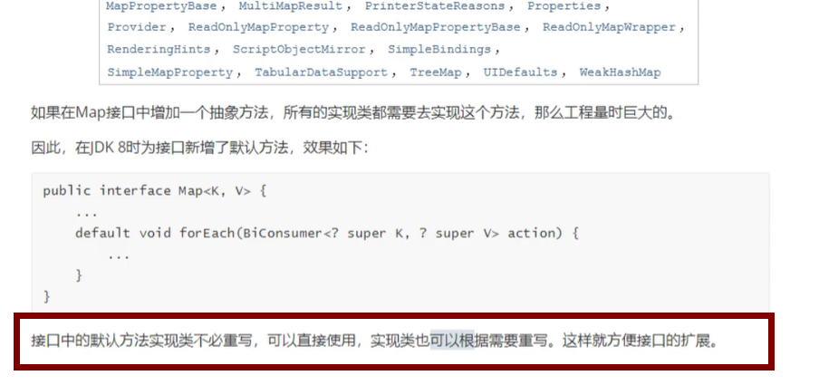

🍊 定义格式

```java
interface interfaceName{
  modifier default returnType methodName(){
    // ...可定义方法体
  }
}
```

🍊 使用方式

1. 实现类直接使用，不重写
2. 实现类重写接口默认方法，再调用

### 静态方法

```java
interface interfaceName{
  modifier static returnType methodName(){
    // ...可定义方法体
  }
}
```

🍬 <font color="red">实现类不会直接继承，不能重写接口静态方法</font>

* 只能通过接口名调用静态方法`接口名.静态方法名()`

## 方法引用

lambda也可能出现冗余

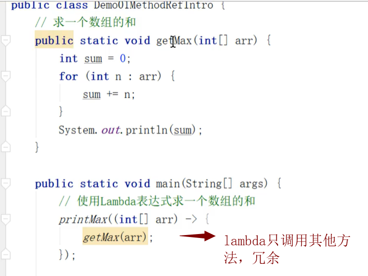

🍊 使用方法引用【<font color="red">特定情况下，对lambda表达式的一种缩写</font>】

* 可理解为，<font color="red">让指定的方法重写接口的抽象方法</font>
* 语法
  * `::`
* <font color="red">应用</font>
  * 如lambda所需实现与其他方法相同，则可以用方法引用，即冗余

🍊 常见引用方式

* `instanceName::methodName`
* `ClassName::staticMethodName`
* `ClassName::methodName`
* `ClassName::new`
  * 调用的构造器
* `TypeName[]::new`
  * 如`String[]::new`调用的String数组的构造器

#### 使用前提

🍬 <font color="red">注意事项</font>

* 被引用的方法，**参数要和接口中抽象方法参数一样**
  * 如`Date::getTime`无参，`Supplier::get`无参
* **当接口抽象方法有返回值，被引用的方法也必须有返回值**

### instanceName::instanceMethod

`对象::实例方法`

```java
Date now = new Date();
Supplier<Long> su1 = now::getTime;
Long a = su1.get();
```

### className::staticMethod

`类名::静态方法`

```java
Supplier<Long> s = System::currentTimeMillis;
Long time = s.get();
```

### className::instanceMethod

`类名::实例方法`

* 通过类名引用实例方法有前提，**实际拿第一个参数作为方法的调用者**

```java
/* 等价 */
Fucntion<String, Integer> f2 = (String str)-> str.length();
Fucntion<String,Integer> f = String::length;
f.apply("hello");
```

```java
/* 等价 */
BiFunction<String, Integer, String> f2 = (String str, Integer i)-> str.substring(i);
BiFunction<String, Integer, String> f = String::subString;
String result = f.apply("hello world",3);
```

### className::new

`类名::new`调用构造器

```java
Supplier<Person> s = Person::new;//调用无参
// BiFuncion<String,Integer,Person> s2 = (String name, Integer age)-> new Person(name,age);
// Person p = s2.apply("abc",12);
BiFuncion<String,Integer,Person> s2 = Person::new;
Person p = s2.apply("abc",12);
```

### type[]::new

`数组::new`引用数组构造器

```java
// Function<Integer, int[]> f = (Integer length)->{
//   return new int[length];
// }
Function<Integer, int[]> f = int[]::new;
int[] a = f.apply(10);// 默认值为0
```

## Stream

🍊 集合操作数据的弊端?

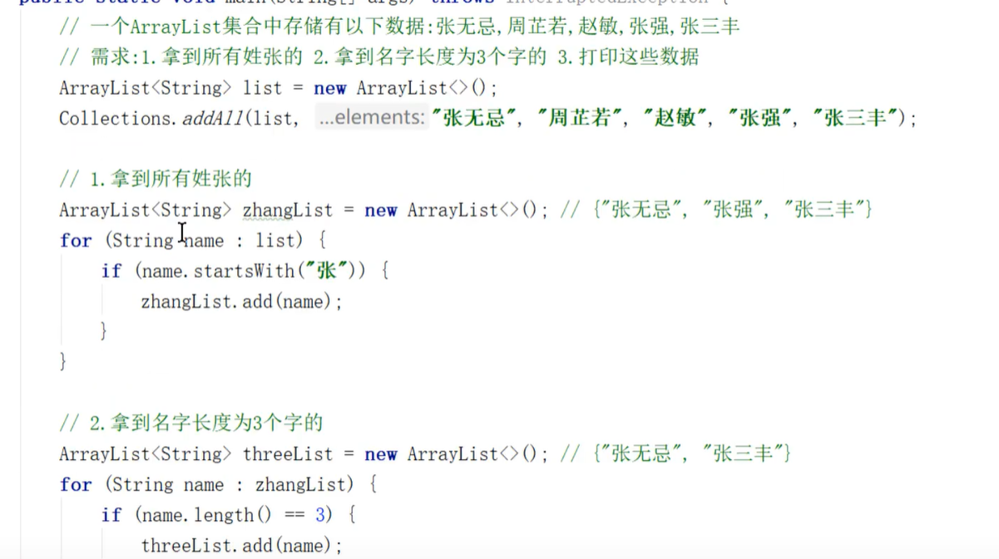

* 筛选每个要求，都需要循环一次，新集合来装筛选出来的数据，麻烦

Stream流操作

* 不保存数据，**只对集合数据进行加工处理**

---

🍊 引入例子

```java
ArrayList<String> list = new ArrayList<>();
Collections.addAll(list, "张a", "张b","c");

// filter(Predicate<? super T> predicate), 接收1个T 返回一个boolean
// forEach(Consumer<? super T> action), 接收1个T，不返回

//获取流，filter()里面传入lambda改写的Predicate实现
// forEach传入lambda改写Consumer实现
list.stream()
  .filter((String s)->{
    s.startsWith("张");
  })
  .filter((s)->{
    return s.length()==3;
  })
  .forEach((s)->{
    System.out.println(s);
  });

/* 等价 */

// 匿名类改写
Predicate<String> p = new Predicate(){
  @Override
  public boolean test(String s){
    return s.startsWith("张");
  }
};
list.stream().filter(p);

// lambda改写test
Predicate<String> p2 = (String s)-> s.startsWith("张");
list.stream().filter(p2);
```

### 获取流的方式

🍊 根据Collection获取流

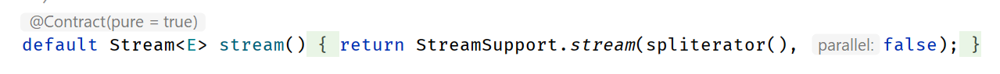

* `Collection`接口默认方法
  * `defaul Stream<E> stream()`

🍬 `Map`集合获取stream

```java
Map<String, String> m = new HashMap<>();
Stream<String> s1 = m.keySet().stream();
Stream<String> s2 = m.values().stream();
Stream<Map.Entry<String, String>> stream = m.entrySet().stream();
```

🍊 其他集合获取stream - `collections.stream()`

```java
List<String> list = new ArrayList<>();
Stream<String> s =list.stream();
//...
```

🍬 数组还可用`Arrays.stream(arr)`工具类方法获取流

---

🍊 根据静态方法Stream.of()获取流

* 注意不能使用基本数据类型的数组，因为会将整个数组看为1个元素

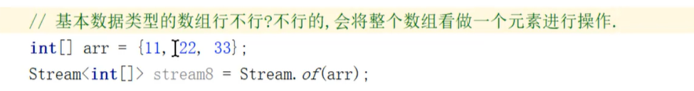
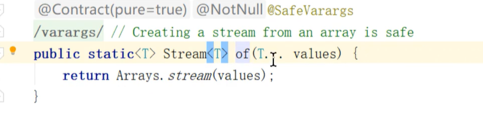

```java
Stream<String> s = Stream.of("aa","bb","cc");// 可变参，本质是数组
String[] str = {"aa","bb","cc"};
Stream<String> s2 = Stream.of(str);
```

### 注意事项(*)

* Stream只能操作一次
  * 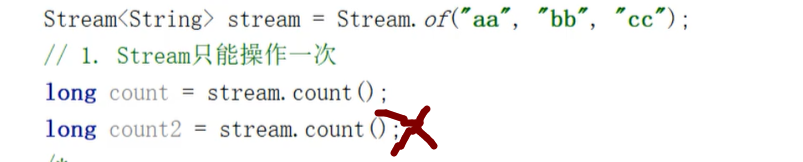
* Stream方法返回的是新的流
* Stream不调用终结方法，中间操作不会执行
  * 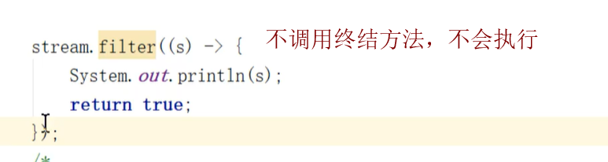

### 常用方法

🍊 重点关注**返回值类型**
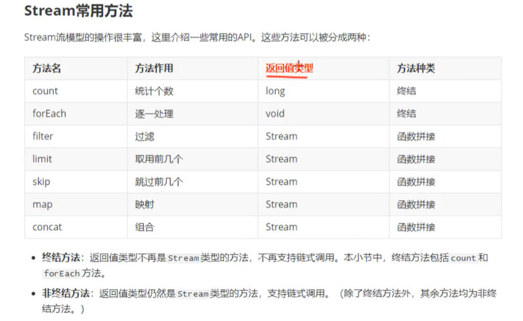

* 终结方法
  * 返回值不是`Stream`，不支持链式调用
  * `count`
  * `forEach(Consumer)`
* 非终结方法
  * 返回值是`Stream`，支持链式调用

#### forEach(Consumer<? super T>)

🍊 forEach用于遍历

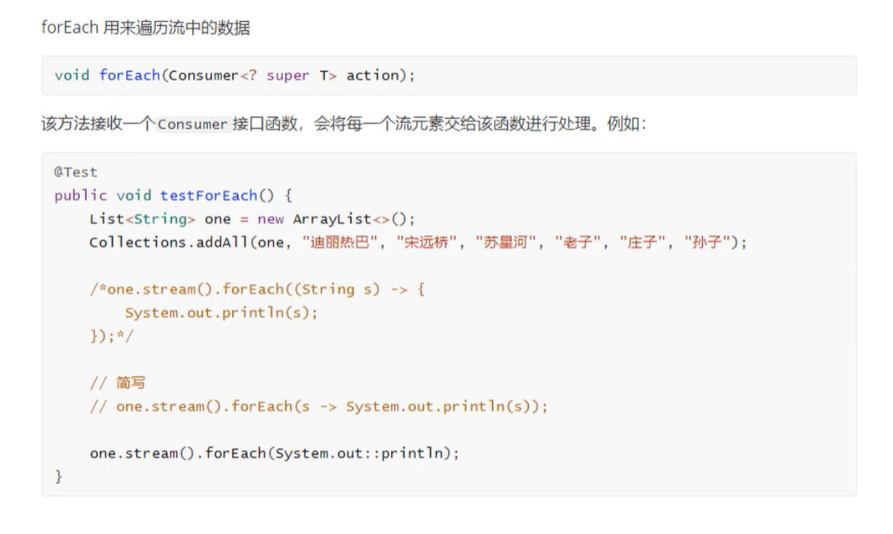

* 终结方法
* 无返回值，接收Consumer，将每个流元素交给该函数进行处理

```java
ArrayList<String> list = new ArrayList<>();
Collections.addAll(list, "张a", "张b","c");
// list.stream()
//   .forEach((String s)->System.out.println(s));
list.stream().forEach(System.out::println); // 使用方法引用
```

#### count()

🍊 count用于统计元素个数

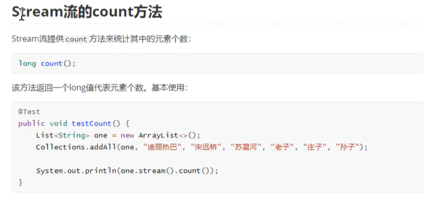

* 终结方法
* 返回`long`

```java
ArrayList<String> list = new ArrayList<>();
Collections.addAll(list, "张a", "张b","c");
long count = list.stream().count();
```

#### filter(Predicate<? super T>)

🍊 用于过滤数据，**返回符合过滤条件的数据**

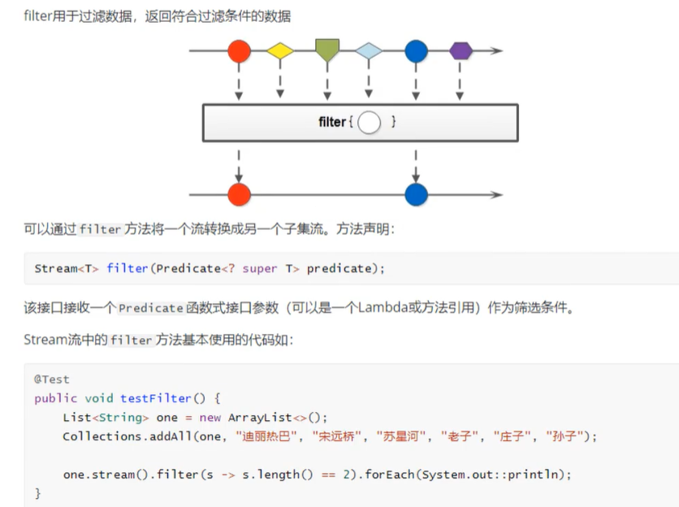

* 接收`Predicate`函数式接口参数，可用lambda/方法引用/内部类重写

```java
ArrayList<String> list = new ArrayList<>();
Collections.addAll(list, "张ab", "张b", "c");
list.stream()
    .filter(s->s.length()==3)
    .forEach(System.out::println); // 方法引用，Consumer传入每个流元素
```

#### limit(long maxSize)

🍊 limit对流进行截取，只取前n个

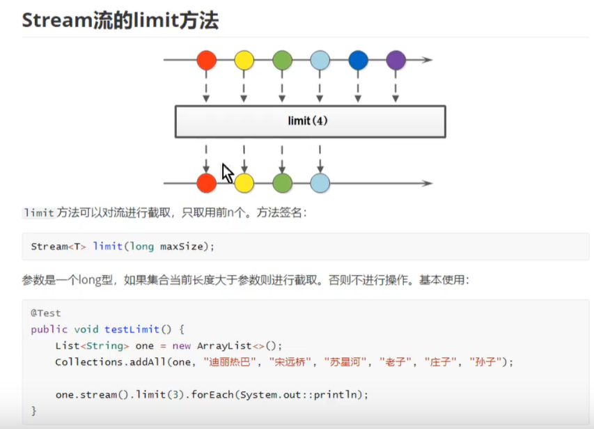

* 接收`long`（集合长度大于该参数时，进行操作）
* 返回`Stream<T>`，非终结方法

```java
ArrayList<String> list = new ArrayList<>();
Collections.addAll(list, "张ab", "张b", "c");

list.stream().limit(3).forEach(System.out::println);// 取前3个元素
```

#### skip(long n)

🍊 跳过前n个元素，截取之后的新流

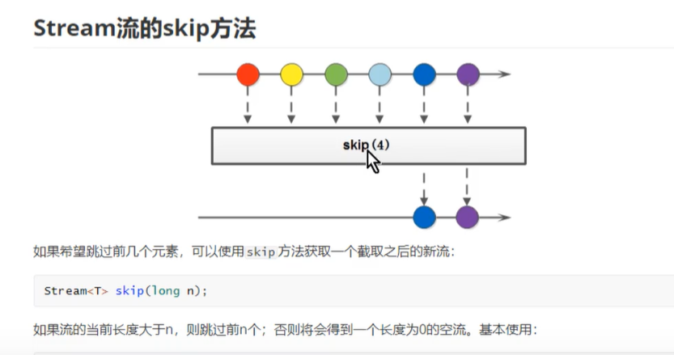

* 非终结方法，返回`Stream`
* 如流长度大于n，则成功跳过前n个
  * 否则返回一个长度为`0`的空流

```java
ArrayList<String> list = new ArrayList<>();
Collections.addAll(list, "张ab", "张b", "c");

list.stream().skip(3).forEach(System.out::println);// 跳过前3个元素
```

#### map(Fucntion<? super T, ? extends R> mapper)

🍊 将流的元素映射到另一个流中

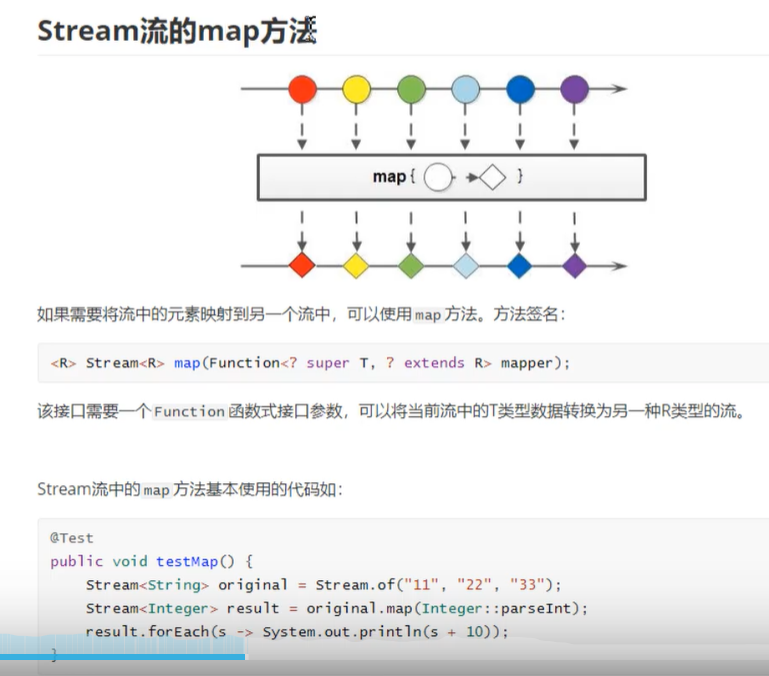

* 返回`Stream`
* 非终结方法
* 接收一个Function函数式接口参数，**可以将当前流中的T类型转换成另一种R类型**

```java
Stream<String> o = Stream.of("11","22","33");
Stream<Integer>n = o.map(str->return Integer.valueOf(str)).forEach(System.out::println);
```

#### sorted(Comparator<? super T>) & sorted()

🍊 sorted将数据排序

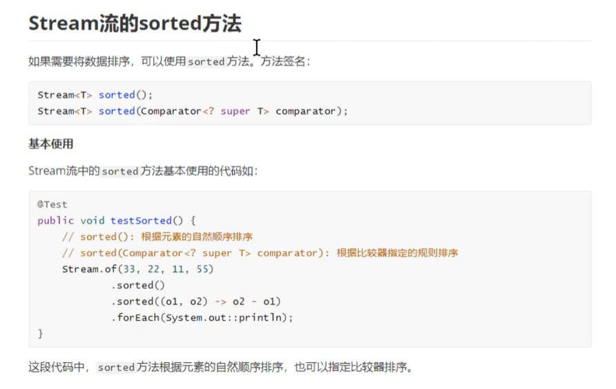

* 无参`sorted()`
  * 返回`Stream`，非终结方法
* 有参比较器`sorted(Comparator<? super T>)`
  * 返回`Stream`，非终结方法
  * 因为`Comparator`也为函数式接口，可以用lambda重写`compare`方法

```java
ArrayList<Integer> list = new ArrayList<>();
Collections.addAll(list,11,22,33,4);
list.stream().sorted().forEach(System.out::println);
```

```java
/* Dscending */
ArrayList<Integer> list = new ArrayList<>();
Collections.addAll(list,11,22,33,4);
list.stream().sorted((Integer o1, Integer o2)->{
    return o2-o1;
}).forEach(System.out::println);
```

可以利用 `Comparator.reverseOrder()`返回的 `Comparator`

#### distinct()

🍊 distinct去除重复数据
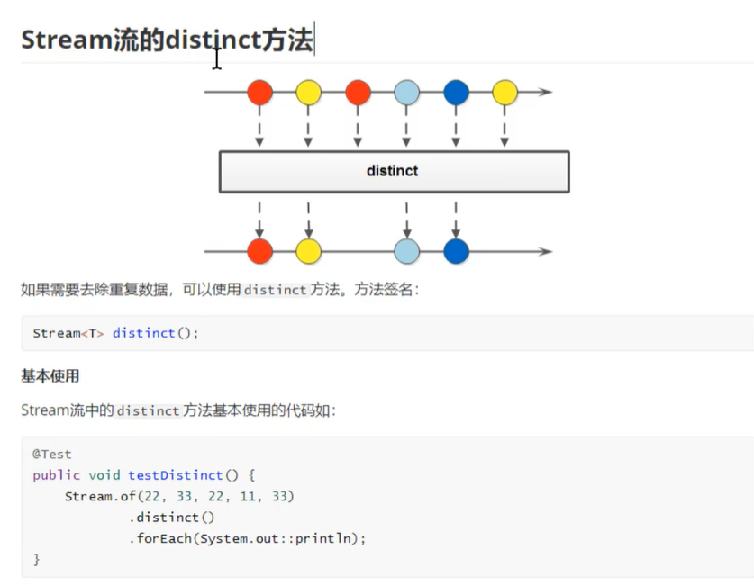

* 非终结方法，返回`Stream`

🍬 注意：**自定义类**，类似HashSet无序，需要重写`hashcode`和`equals`

```java
ArrayList<Integer> list = new ArrayList<>();
Collections.addAll(list,11,22,33,33,4);
list.stream().distinct().forEach(System.out::println);
```

#### match

🍊 判断数据是否匹配指定的条件

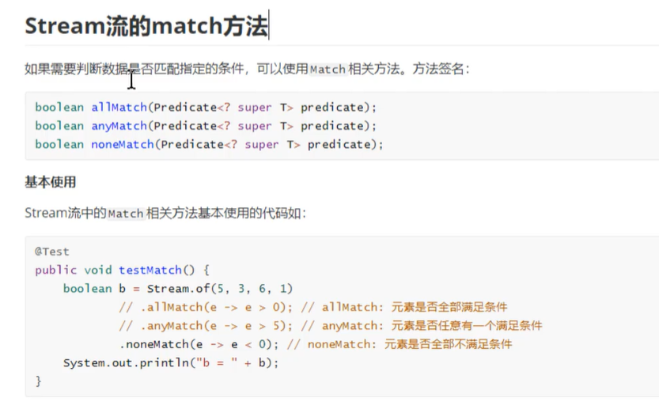

* 返回`boolean`，接收`Predicate`，终结方法
* `allMatch(Predicate<? super T>)` 匹配所有元素，所有元素都不满足条件
* `anyMatch(Predicate<? super T>)` 某个元素匹配，只要一个元素满足条件即可
* `noneMatch(Predicate<? super T>)` 匹配所有元素，所有元素不满足条件

```java
ArrayList<Integer> list = new ArrayList<>();
Collections.addAll(list,11,22,33,33,4);
boolean flag = list.stream().allMatch((integer) -> integer > 3);
// boolean flag = list.stream().anyMatch((integer) -> integer > 3);
// boolean flag = list.stream().noneMatch((integer) -> integer > 3);
System.out.print(flag);
```

#### findFirst() & findAny()

🍊 找某些元素

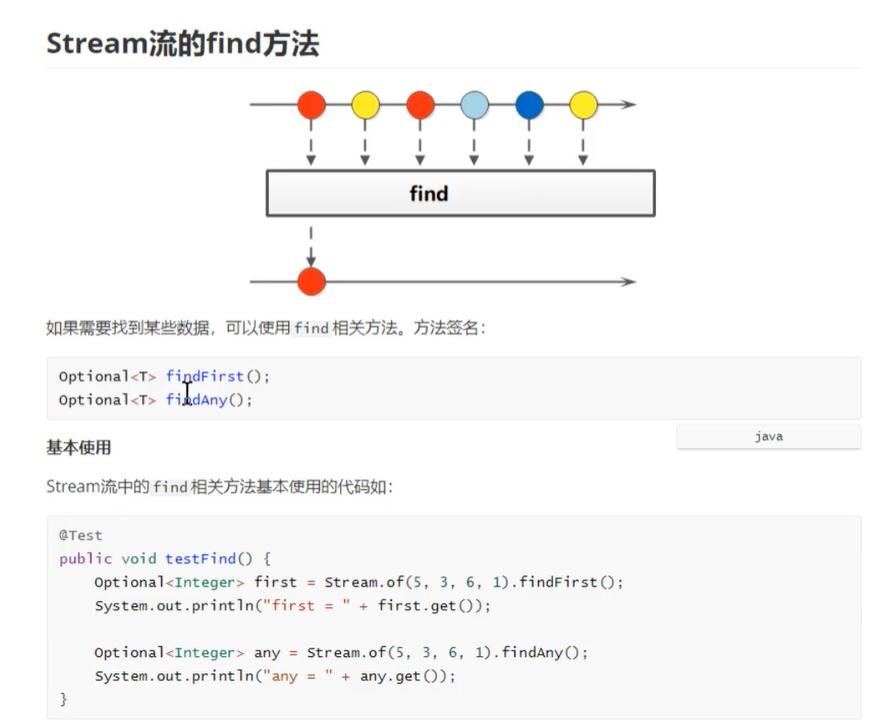

* 返回`Optional<T>`，终结
  * 避免了空指针检测？
  * 可用`option.get()`获取值。如Optional为`null`，`get`会抛出异常
* `findFirst()` 返回第一个元素
* `findAny()` 一般返回第一个元素

```java
ArrayList<Integer> list = new ArrayList<>();
Collections.addAll(list,11,22,33,33,4);
Optional<Integer> first = list.stream().findFirst();
// Optional<Integer> first = list.stream().findAny();
Integer integer = first.get();
```

```java
A a =bList().stream().filter(b->"test".equals(b.getName())).findAny().orElse(null);
```

#### max(Comparator) & min(Comparator)

🍊 获取max&min值

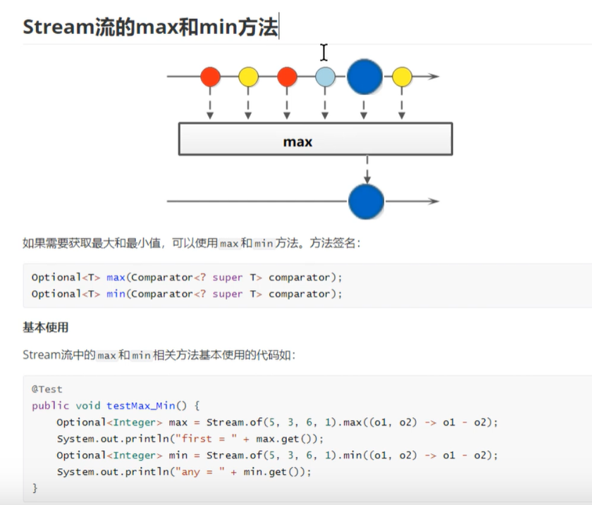

* 返回`Optional<T>`, 传入`Comparator<? super T>`比较器【指定比较规则】
  * 可用lambda重写
* `max(Comparator<? super T>)`
* `min(Comparator<? super T>)`

🍬 注意`IntStream`的max&min

* `OptionalInt max()`
  * `OptionalInt`自带空指针检测， 调用`getAsInt()`获取int值
* `OptionalInt min()`
  * `OptionalInt`自带空指针检测， 调用`getAsInt()`获取int值

```java
Option<Integer> i = Stream.of(5,3,6,1).max((o1, o2)-> o1-o2);
Integer a = i.get();

Integer min = Stream.of(5,3,6,1).min((o1, o2)-> o1-o2).get();
```

#### (*) reduce(T, BinaryOperator)

🍊 将所有数据归纳后得到一个数据（常用）

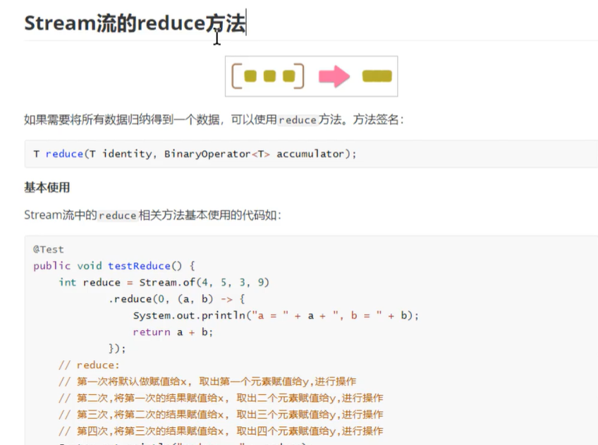


* `T reduce(T identity, BinaryOperator<T> accumulator)`
* `T identity`默认值
* `BinaryOperator<T> accumulator` 对数据进行处理的操作
  * 继承了`BiFunction<T,U,R>`函数式接口，可使用其`R apply(T,U)`方法
  * `BinaryOperator<T>`传入`BiFunction<T,T,T>`
  * 第一次，默认值赋给`T`，取出的元素赋给`U`

🍊 用处？

* 可比较大小，获取最大值

```java
ArrayList<Integer> list = new ArrayList<>();
Collections.addAll(list,11,22,33,33,4);
Integer i = list.stream().reduce(0, (T, U) -> {
   return T>U ? T:U;
});
```

```java
Integer result = Stream.of(4,5,3,9).reduce(0, (x,y)->x+y);
```

#### map & reduce

🍊 map&reduce结合使用

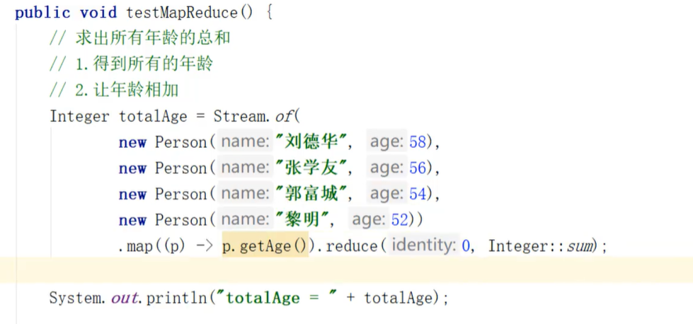
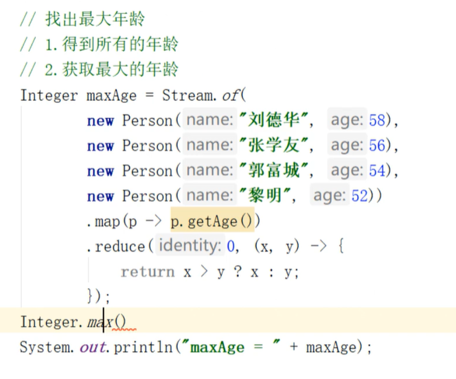
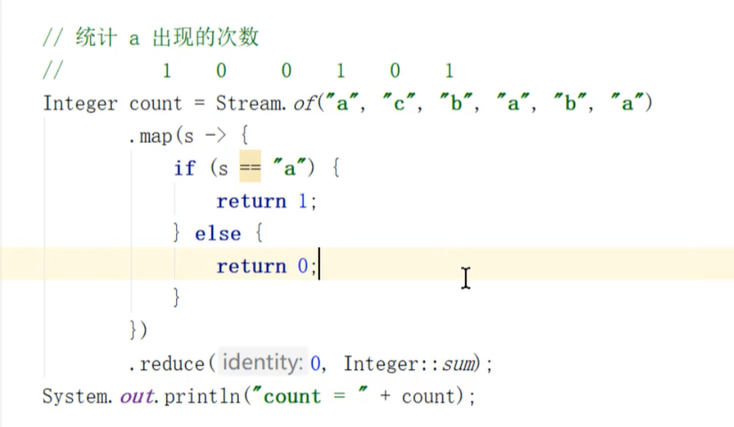

#### mapToInt(ToIntFunction)

🍊 将`Stream<Integer>`中的`Integer`转为`int`

* 包装类效率略低，占用内存比基本数据类型多
  * **流操作中会自动装拆箱，费内存**。<font color="red">推荐直接操作基本类型</font>
* `IntStream mapToInt(ToIntFunction<? super T> mapper)` 返回 `IntStream`
  * `ToIntFunction<T>`函数式接口，`int applyAsint(T)`方法

```java
/* 转换后内部int数据，节省内存，减少自动装拆箱 */
IntStream s = Stream.of(1,2,3,4,5).mapToInt((Integer n)->n.intValue());
```

#### Stream.concat

🍊 合并两个流

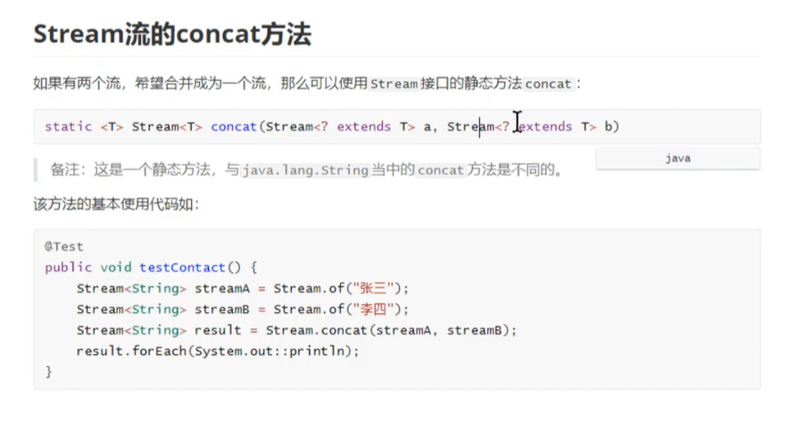

* 静态方法`Stream.concat(Stream<T> , Stream<T>)`
  * 返回`Stream<T>`
  * 类型必须一致
* <font color="red">合并之后不支持操作前面的流</font>

```java
Stream<Integer> a = Stream.of(1);
Stream<Integer> b = Stream.of(2);
Stream<Integer> c = Stream.concat(a,b);
```

### 收集Stream流中的结果

对流操作完成后，将流的结果存入数组/集合
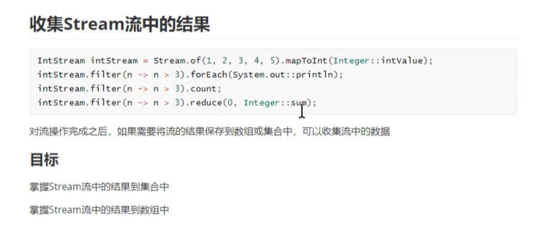

* 流结果->集合
* 流结果->数组

#### 数据收集至集合: collect()

* `collect(Collectors.toList())`将流中数据收集至`List`集合中
* `collect(Collectors.toSet())`将流中数据收集至`Set`集合中

🍬 注意，如收集至指定的特定集合中

* `ArrayList` - `stream.collect(Collectors.toCollection(Supplier<C> collectionFactory))`
  * 如集合构造器`stream.collect(Collector.toCollection(ArrayList::new))`
* `HashSet` - `Sstrea.collect(Collectors.toCollection(HashSet::new))`

```java
Stream<String> s = Stream.of("1","2");
List<String> l = stream.collect(Collectors.toList());
Set<String> s = stream.collect(Collectors.toSet());
```

#### 数据收集至数组: toArray()

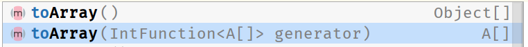

* `Object[] toArray()`
  * 操作麻烦
* `<A> A[] toArray(IntFunction<A[]> generator)`
  * 函数式接口，接收一个指定数组类型的构造器，返回该数组
  * 终结操作
  * `IntFunction`接口`R apply(int value)``value`接收数组大小

```java
ArrayList<String> list = new ArrayList<>();
Collections.addAll(list,"1","2","3","2");
String[] a = list.stream().toArray(String[]::new);
```

#### 聚合计算收集流数据

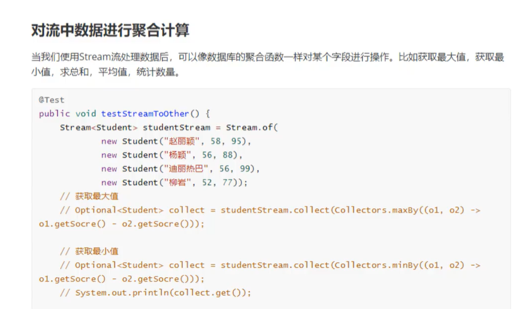

* 如max, min, sum, avg, count等操作进行聚合收集
  * <font color="red">通过Collectors收集器收集,聚合</font>,再通过`stream.collect(R Collector<? super T, A, R>)`提取数据
* 最大值 - `Collector<T, ?, Optional<T>> Collectors.maxBy(Comparator<? super T> comparator)`
  * 之前用`reduce(T, BinaryOperator)`,`max(Comparator)`
* 最小值 - `Collector<T, ?, Optional<T>> Collectors.minBy(Comparator<? super T> comparator)`
  * 之前用`reduce(T, BinaryOperator)`,`min(Comparator)`
* 总和 - `Collector<T, ?, Integer> Collectors.summingInt(ToIntFunction<? super T> mapper)`
  * 之前用`reduce(T, BinaryOperator)`
* 平均值 - `Collector<T, ?, Double> averagingInt(ToIntFunction<? super T> mapper)`
* 统计数量 - `Collector<T, ?, Long> counting()`
  * 之前用`stream.count()`,终结方法

```java
/* 获取max */

ArrayList<String> list = new ArrayList<>();
Collections.addAll(list,"1","2","3","2");
Optional<Integer> collect = list.stream().map(str -> Integer.valueOf(str)).collect(Collectors.maxBy((o1, o2) -> o1 - o2));
System.out.println("collect.get() = " + collect.get());

/* 获取min */

Optional<Integer> min = list.stream().map(str->Integer.valueOf(str)).collect(Collectors.minBy((o1,o2)->o1-o2);
System.out.println(min.get());

// IntStream i = list.stream().map(str->Integer.valueOf(str)).mapToInt((integer)->integer.intValue());
// //         get max value
// OptionalInt max = i.max();
// System.out.println(max.getAsInt());
```

```java
/* 求和 */
ArrayList<String> list = new ArrayList<>();
Collections.addAll(list,"1","2","3","2");
Integer sum = list.stream().collect(Collectors.summingInt(str->Integer.valueOf(str)));
```

```java
/* 平均值 */
ArrayList<String> list = new ArrayList<>();
Collections.addAll(list,"1","2","3","2");
Double collect = list.stream().collect(Collectors.averagingInt(str -> Integer.valueOf(str)));
System.out.println(collect);
```

```java
/* 统计数量 */
ArrayList<String> list = new ArrayList<>();
Collections.addAll(list,"1","2","3","2");
Long collect = list.stream().collect(Collectors.counting());
System.out.println(collect);
```

#### 流数据分组

🍬 **分组可以根据需求有多个组，分区只能有两个boolean组**

🍊 流处理数据后,可根据某个属性将数据分组

* `Collector<T, ?, Map<K, List<T>>> groupingBy(Function<? super T, ? extends K> classifier)`
  * 传入T作为map集合的value-List< T>，返回K作为map集合的key
* `map`jdk8支持`forEach(BiConsumer<T,U>)`

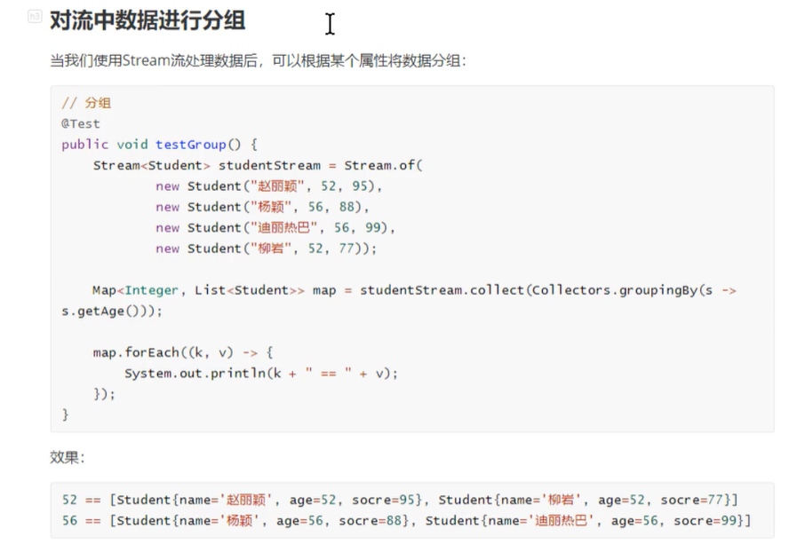
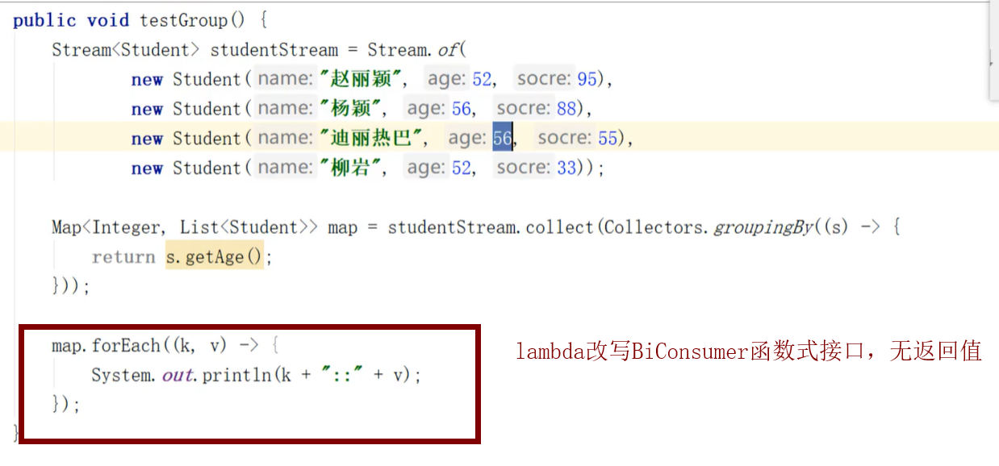


##### 多级分组

`Collector<T, ?, Map<K, D>> groupingBy(Function<? super T, ? extends K> classifier, Collector<? super T, A, D> downstream)`

* `D`第二个Collector的返回值，主要看最后操作
  * 如，groupingBy返回map集合，即返回`Map<D, Collection<A>>`

* 如先按年龄分组，再按成绩分组

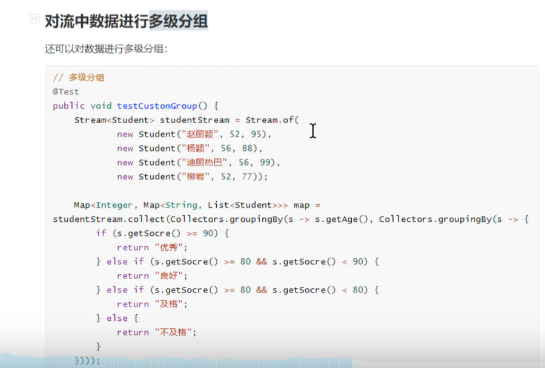
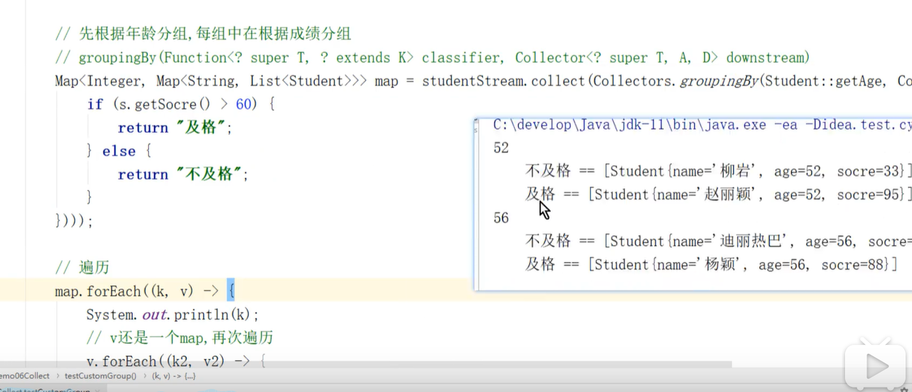

#### 流数据分区

🍬 **分组可以根据需求有多个组，分区只能有两个boolean组**

🍊 `Collectors.partitioningBy`

* 根据值是否为true，将集合分割为两个列表
  * true列表
  * false列表
* `Collector<T, ?, Map<Boolean, List<T>>> partitioningBy(Predicate<? super T> predicate)`
* 多级分区 - `Collector<T, ?, Map<Boolean, D>> partitioningBy(Predicate<? super T> predicate, Collector<? super T, A, D> downstream) `

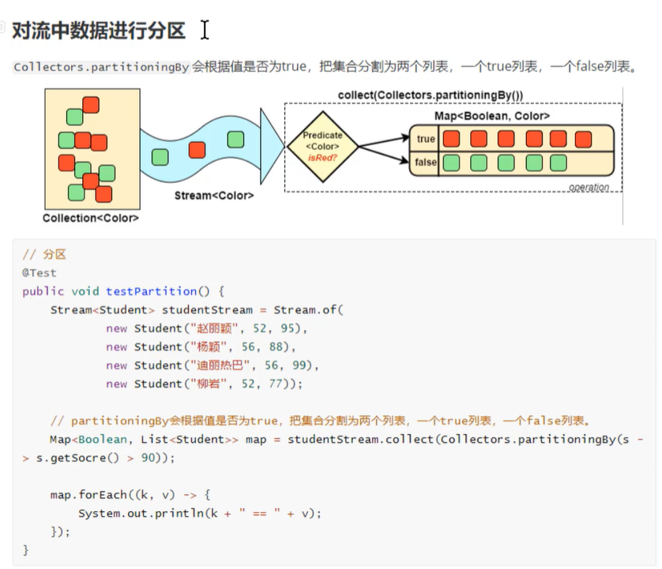

#### 流数据拼接

`Colletors.joining`根据指定的连接符，将所有元素连接成一个字符串

* `Collector<CharSequence, ?, String> joining()`
* `Collector<CharSequence, ?, String> joining(CharSequence delimiter)`根据一个字符串拼接
* `Collector<CharSequence, ?, String> joining(CharSequence delimiter, CharSequence prefix, CharSequence suffix)`根据三个字符串拼接

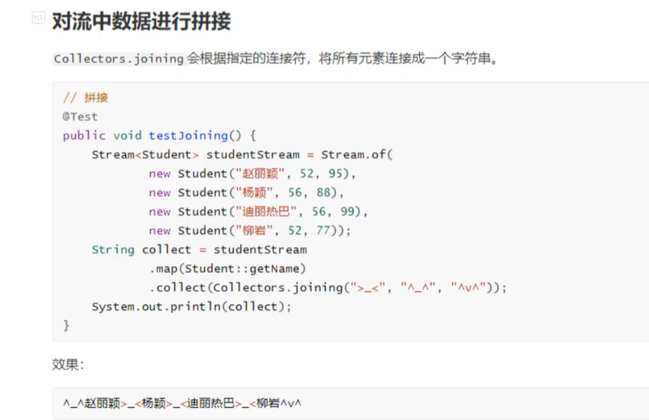

### range() & rangeClosed()

`IntStream` & `LongStream`都实现

* 生成数值流
* `range(startInClusive, endExclusive)`不包括最后一个数字
* `rangeClosed(startInclusive, endInclusive)`包括最后一个数字

🍬 `boxed()`将数值流转化为普通流`Stream`

### Parallel Stream

🍊 效率对比

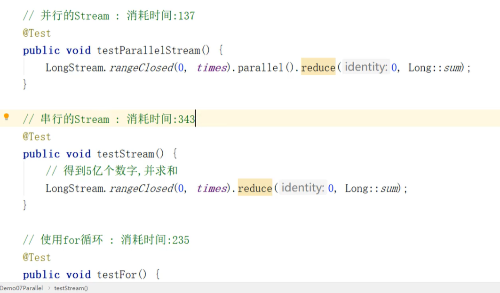

* 并行流，分治法，效率最高

#### 获取并行Stream

🍊 直接获取并行Stream流

* `collection.parallelStream()`

🍊 将串行流转换为并行流

* `collection.stream().parallel()`

#### 并行流: 线程安全

如`ArrayList`线程不安全，并行流生成的有序元素并发加入集合，会出现线程安全问题

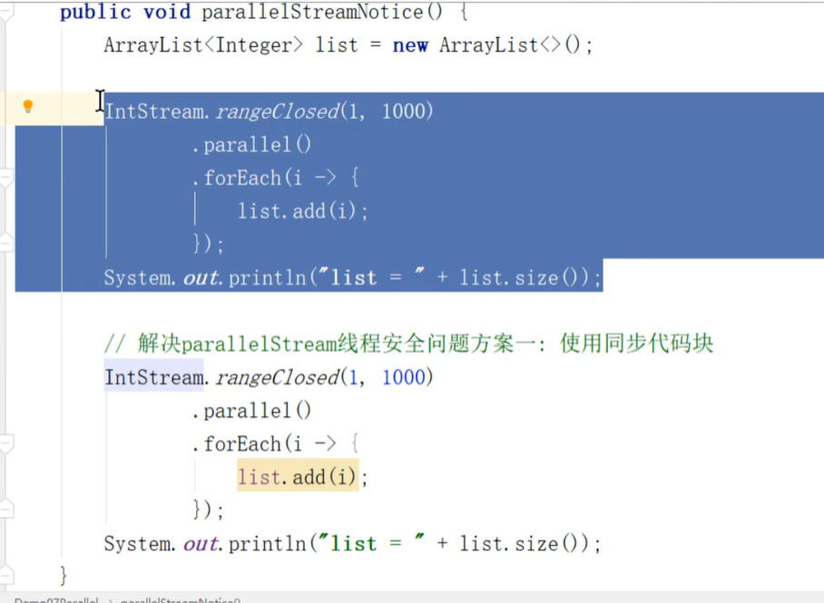

🍊 解决线程安全问题

* 使用同步代码块

```java
// 外部定义一个锁
ArrayList<Integer> a = new ArrayLsit<>)();

Object o = new Object();
IntStream.rangeClosed(1,1000)
  .parallel()
  .forEach(i ->{
    synchronized(obj){
      a.add(i);
    }
  });
```

* 使用线程安全的集合
  * 已定义好的`Vector`,`TreeSet`, `TreeMap`
  * 工具类方法`Collections.synchronizedList(List<T >)`& `Collections.synchronizedSet(Set<T >)` & `Collections.synchronizedMap(Map<T >)`

```java
Vector<Integer> v = new Vector();

Object o = new Object();
IntStream.rangeClosed(1,1000)
  .parallel()
  .forEach(i ->{
    synchronized(obj){
      a.add(i);
    }
  });
```

* 使用`stream.collect/toArray()`
  * 之前要对并行流进行`boxed()`将数值流转化为Stream,之后再收集进集合/数组

```java
List<Integer> l = IntStream.rangeClosed(1,1000).parallel().boxed().collect(Collectors.toList());
```

#### 并行流: 实现原理 Fork/Join

🍬 小结

* `parallelStream`线程不安全
* `parallelStream`适用CPU密集型场景
* 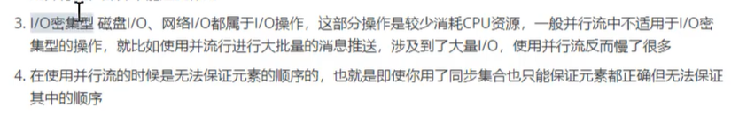

并行流底层使用`Fork/Join`框架,可以将一个大任务拆分为很多小任务异步执行

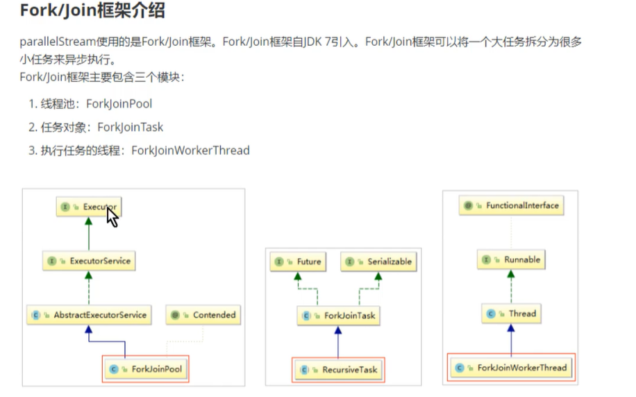

* 线程池 ForkJoinPool
* 任务对象 ForkJoinTask
* 执行任务的线程 ForkJoinWorkerThread

##### Fork/Join原理: 分治法 & 工作窃取法

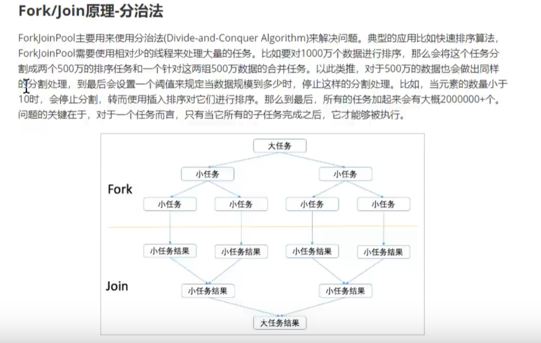
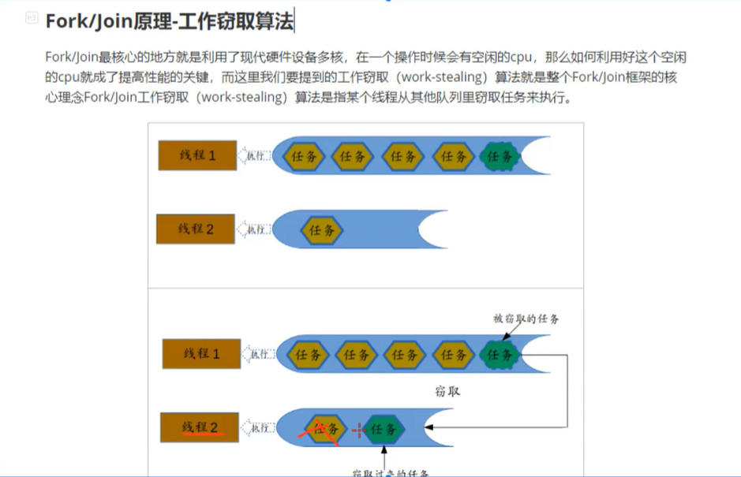
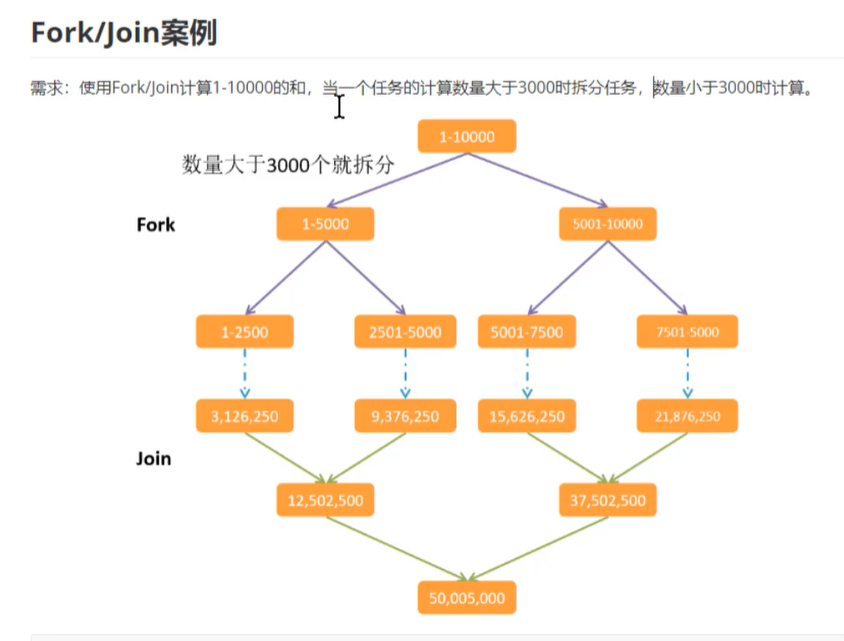

🍊 主要方法

* `ForkJoinTask` - 子类 `RecursiveAction`无返回值 & `RecursiveTask`有返回值
  * `fork()` - 在当前线程运行的线程池中安排一个异步执行。简单的理解就是再创建一个子任务
  * `join()` - 任务完成时返回结果
* `ForkJoinPool` - 线程池
  * `invoke(ForkJoinTask)` - 开始执行任务，等待计算(如需)

```java
// 【创建一个求和任务】
// RecursiveTask: 一个任务
class SumRecursiveTask extends RecursiveTask<Long>{
  // 拆分任务的临界值
  private static final long THRESHOLD= 3000L;
  // 起始值
  private final long start;
  // 结束值
  private final long end;

  // 每个任务
  public SumRecursiveTask(long start, long end){
    this.start = start;
    this.end = end;
  }

  @Override
  protected Long compute(){
    long length = end- start;//要计算的数量
    if (length<THRESHOLD){
      // 计算
      long sum =0;
      for (long i=start;i<>end;i++){
        sum+=i;
      }
      return sum;
    }else{
      // 拆分任务
      long mid = (start + end)/2;
      SumRecursiveTask left = new SumRecursiveTask(start, mid);
      left.fork();
      SumRecursiveTask right = new SumRecursiveTask(mid+1, end);
      right.fork();

      return left.join() + right.join();
    }
  }
}
```

```java
/* 将任务放入线程池 */
public class DemoForkJoin{
  public static void main(String[] args){
    // 计算执行时间
    long start = System.currentTimeMillis();
    // 创建一个池
    ForkJoinPool pool = new ForkJoinPoll();

    SumRecursiveTask task = new SumRecursiveTask(1, 10000);
    Long result = pool.invoke(task);//执行任务
    long end = System.currentTimeMillis();
    long timing = end - start;
  }
}
```

## Optional

以前对null检测方式 - if判断，麻烦

🍊 Optional没有子类的工具类。可以是一个为`null`的容器对象


* 主要为了避免`null`检查，防止`NullPointerException`

### 创建方式

* `Optional<T > Optional.of(T)`
  * 不支持传入`null`，如需传空值，使用`Optional.ofNullable(null)`
* `Optional<T > Optional.ofNullable(T)`
* `Optional<Object > Optional.empty()`
  * 传入`null`

### 常用方法

* 判断Optional是否有具体值
  * `boolean isPresent()`
* 获取Optional值
  * `T get()`，如为null会抛出异常，一般结合isPresent使用
* 如为空则返回指定值
  * `T orElse(T)`

---

* `void ifPresent(Consumer)`
  * 有值时，Consumer函数式接口传入参数
* `void ifPresentOrElse(Consumer<? super T> action, Runnable emptyAction)`
  * 有值时...无值时...
* `Optional<U > map(Function<? super T, ? extends U> mapper)`类型转换

## 新日期&时间API

🍊 旧版日期时间API存在的问题

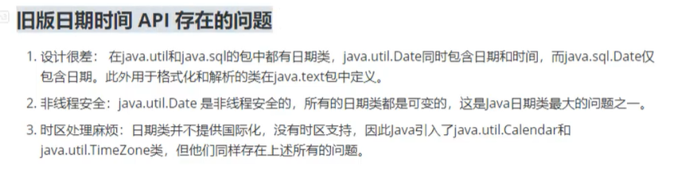

* 设计不合理`Date`有两个类，包不同
  * 初始化year会加上1900，`Date now = new Date(year, month,date)`
* 时间格式化&解析**线程不安全**
  * 之前使用SimpleDateFormat进行解析&格式化
  * `SimpleDateFormat sdf = new SimpleDateFormat("yyyy-MM-dd")`, `Date date = sdf.parse("2019-09-09")`
  * 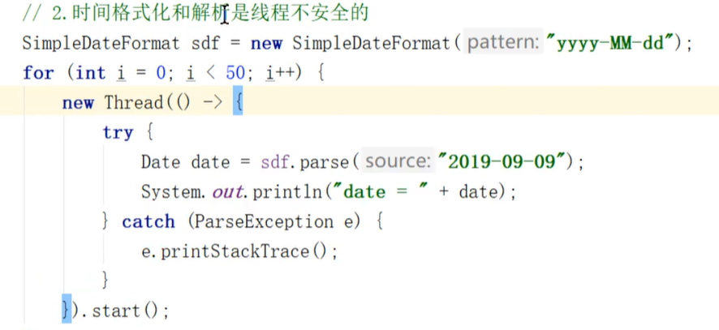
* 旧版时区处理麻烦
  * 日期类不提供国际化，没有时区支持

🍊 新版时间日期API

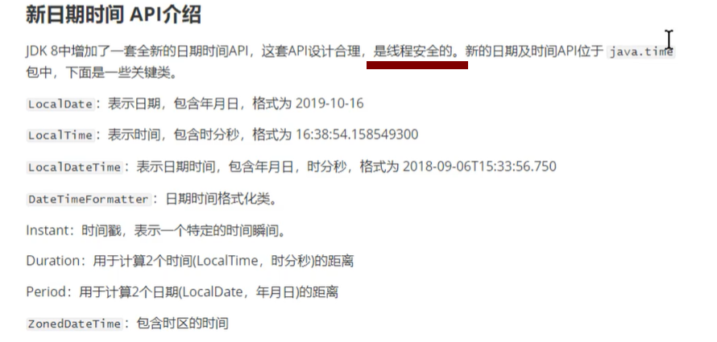
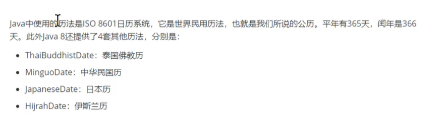

### LocalDate

表示日期，年月日

* 当前日期 - `static LocalDate now()`
* 指定年月日 - `static LocalDate of(int year, Month month, int dayOfMonth)`
* `int getYear()`
* `Month getMonth()`
  * 返回枚举
* `int getMonthValue()`
* `int getDayOfMonth()`

```java
LocalDate now = LocalDate.now();//当前日期
LocalDate date = LocalDate.of(2018,8,8);//指定年月日
```

### LocalTime

表示时间，时分秒

* 当前时间 - `static LocalTime now()`
* 指定时间 - `static LocalTime of(int hour, int minute, int second)`
* 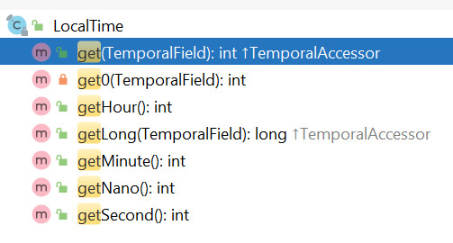

```java
LocalTime t = LocalTime.now();
LocalTime t2 = LocalTime.of(13,26,39);
```

### LocalDateTime

表示日期时间，年月日，时分秒

* `static LocalDateTime now()`
* 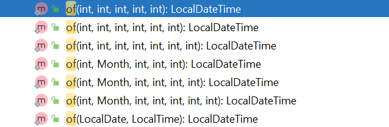
* 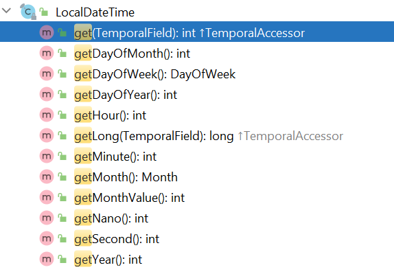

### 共通方法：修改时间

LocalDate，LocalTime，LocalDateTime修改

* 直接修改 - withXXX()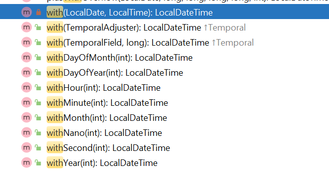
  * 修改后返回新的对象，不会修改旧的
* 增加 - plusXXX()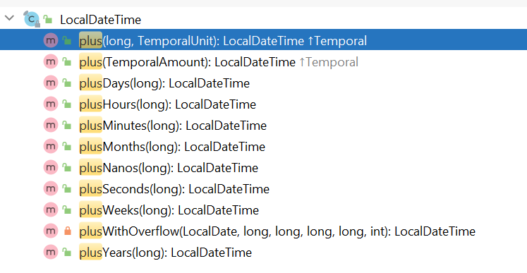
* 减少 - minusXXX()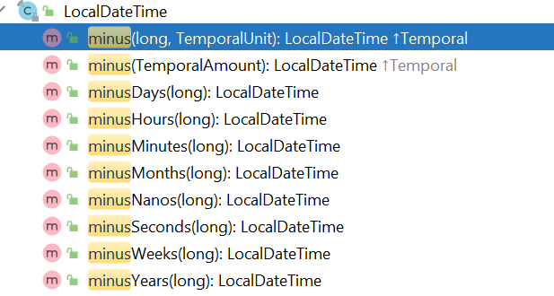
* 比较时间 - 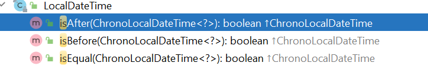

```java
LocalDateTime date = LocalDateTime.now();
LocalDateTime n = date.withYear(9102);

now.plusYears(2);//加
now.minusYears(10);//减
```

```java
/* 比较时间 */
LocalDateTime t = LocalDateTime.of(2018,7，12，3，28，23);
LocalDateTime date = LocalDateTime.now();

date.isAfter(t);
date.isBefore(t);
date.isEqual(t);
```

### DateTimeFormatter: 时间格式化 & 解析

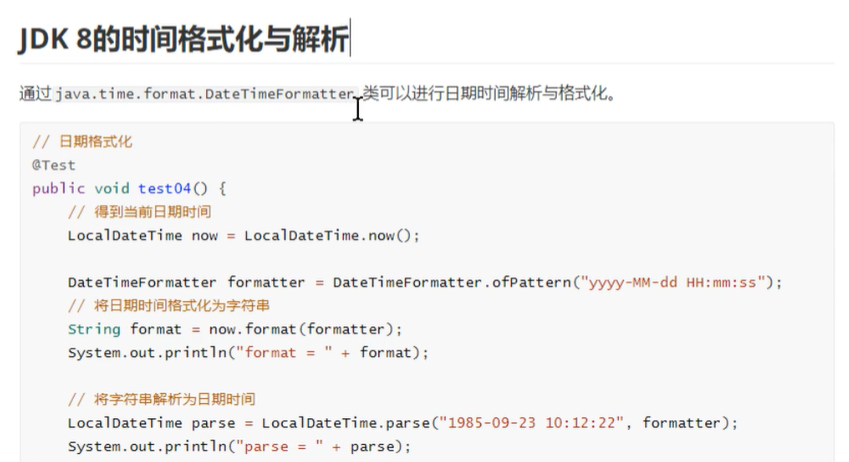

* 格式化 - `String format(DateTimeFormatter formatter)`
* 指定时间格式 - `static DateTimeFormatter ofPattern(String pattern)`
* 解析 - `static LocalDateTime parse(CharSequence text, DateTimeFormatter formatter)`

```java
LocalDateTime now = LocalDateTime.now();

// formatting
DateTimeFormatter f = DateTimeFormatter.ISO_DATE_TIME;//jdk8自带格式
String s = now.format(f);
DateTimeFormatter f1 = DateTimeFormatter.ofPattern("yyyy年MM月dd HH时mm分ss秒");//指定格式
String s1 = now.format(f1);


//parsing
LocalDateTime t = LocalDateTime.parse("2019年10月19 15时16分16秒", f1);

/* 支持多线程 */
/*
for(int i-=;i<50;i++){
  new Thread(() ->{
    LocalDateTime t = LocalDateTime.parse("2019年10月19 15时16分16秒", f1);
  }).start();
}
*/
```

### Instant: 时间戳

时间戳/时间线，**内部保存**自1970年依以来的**秒&纳秒**
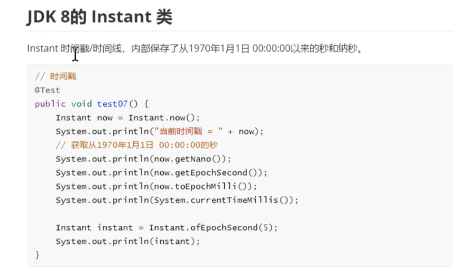

* 不提供给用户，一般用于程序统计【操作秒，纳秒方便】
* 支持加减，`plusXXX`&`minusXXX`
* 获取，`getXXX`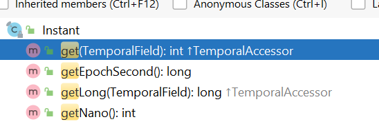

```java
Instant now = Instant.now();
Instant instant = Instant.now().plusSeconds(20);

```

### Duration/Period: 日期时间差类


* between让后面的参数减去前面的参数
* `Duration`
  * 计算时间`LocalTime`，时分秒差距
  * `static Duration between(Temporal startInclusive, Temporal endExclusive)`
  * 获取相差的字段数值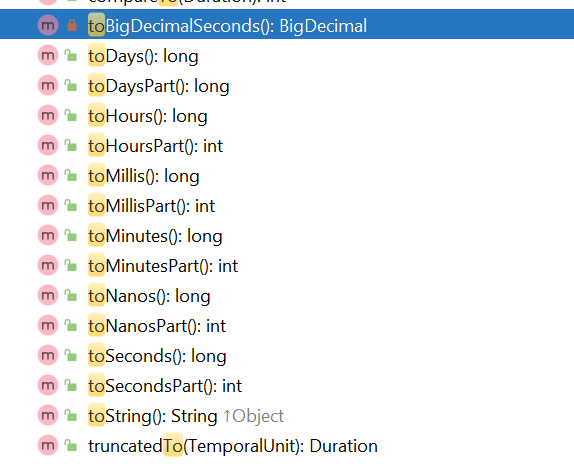
* `Period`
  * 计算日期`LocalDate`，年月日差距
  * `static Period between(LocalDate startDateInclusive, LocalDate endDateExclusive)`
  * 获取相差的字段数值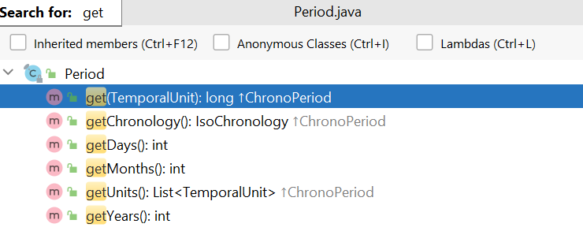

```java
/* 计算时间距离 */
LocalTime now = LocalTime.now();
LocalTime t = LocalTime.of(14,15,20);
Duration duration = Duration.between(t,now);
//看差值
System.out.println(between.toDays());
System.out.println(between.toHours());
System.out.println(between.toMillis());
```

```java
LocalDate now = LocalDate.now();
LocalDate of = LocalDate.of(2020, 8, 22);
Period between = Period.between(of, now);
System.out.println(between.getDays());
System.out.println("between.getMonths() = " + between.getMonths());
```

### TemporalAdjuster(s): 时间校正器

🍊 修改时间

* 直接调用时间日期的`withXXX`&`plusXXX`&`minusXXX`方法
* 或使用时间校正器【更精确】
  * 如将日期调整到下一个月的第一天
  * `TemporalAdjuster` - 时间校正器（函数式接口）
  * `TemporalAdjusters` - 自带静态方法实现了很多定义好的校正器

🍊 `TemporalAdjuster`调整器，函数式接口，lambda/匿名类重写抽象方法

* `Temporal adjustInto(Temporal temporal);`
  * 接收时间日期对象
* 时间日期对象.with(TemporalAdjuster adjuster)
  * 传入自定义校正器，调用该接口中重写的方法，直接修改对象

```java
LocalDate now = LocalDate.now();
TemporalAdjuster toFirstDay = new TemporalAdjuster() {
    @Override
    public Temporal adjustInto(Temporal temporal) {
        LocalDate temporal1 = (LocalDate) temporal;
        return temporal1.plusMonths(1).withDayOfMonth(1);
    }
};
LocalDate with = now.with(toFirstDay);
```

---

🍊 使用自带的校正器

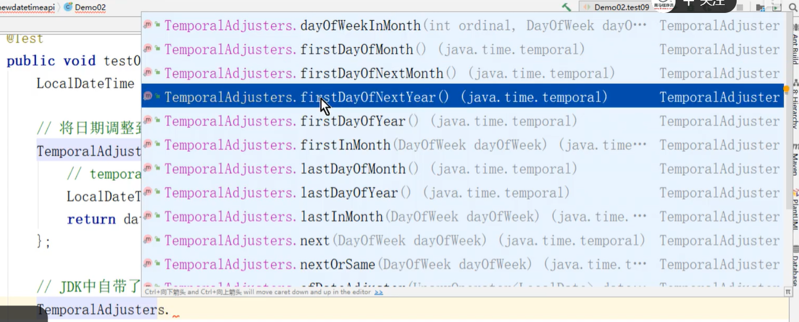

```java
LocalDate now = LocalDate.now();
TemporalAdjuster temporalAdjuster = TemporalAdjusters.firstDayOfNextYear();
System.out.println(now.with(temporalAdjuster));
```

### ZonedDate(Time):设置时区

🍊 前面LocalDate,LocalTime,LocalDateTime不带时区

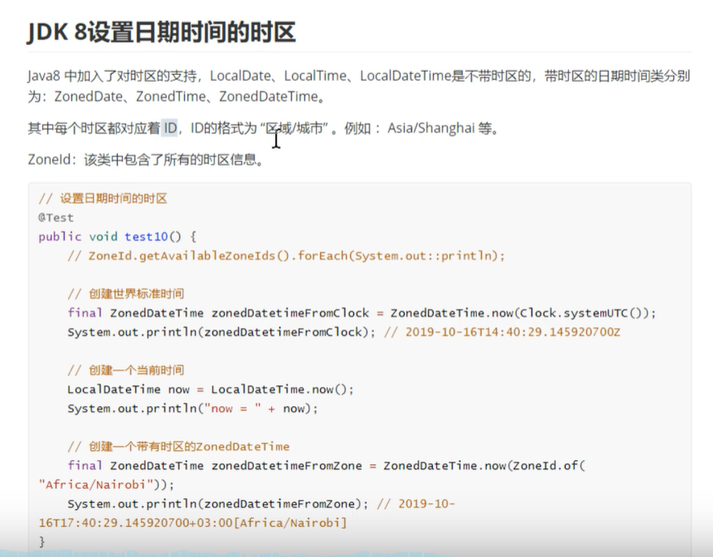

* `ZonedDate`
* `ZonedTime`
* `ZonedDateTime`

🍬 每个时区都对应ID，格式为`区域/城市`

```java
/* 获取所有时区ID */
ZonedId.getAvailableZoneIds().forEach(System.out::println);

LocalDateTime now = LocalDateTime.now();//不带时区

/* 操作带时区的类 */
//创建世界标准时间Clock
ZonedDateTime now1 = ZonedDateTime.now(Clock.systemUTC());

//创建本地时区对象
ZonedDateTime now2 = ZonedDateTime.now();

//创建指定时区时间，传入时区ID
ZonedDateTime.now(ZoneId.of("America/Vancouver"));
```

```java
/* 修改时区：ZonedDateTime withZoneSameInstant(ZoneId zone) */
ZonedDateTime now2 = ZonedDateTime.now();
ZonedDateTime zonedDateTime = now2.withZoneSameInstant(ZoneId.of("America/Vancouver"));
```

## 重复注解 & 类型注解

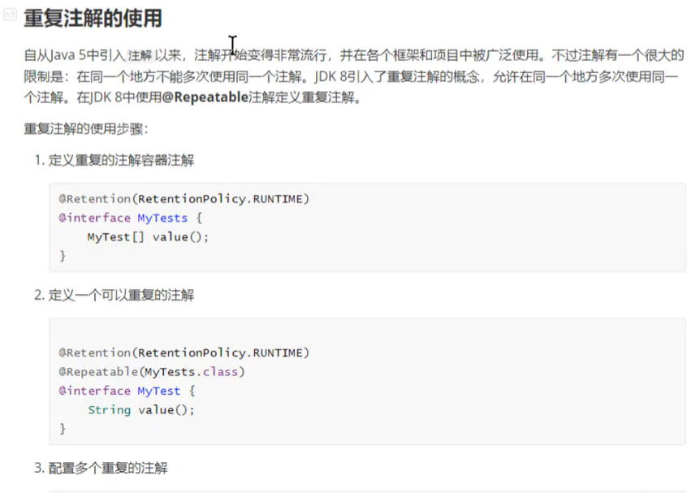
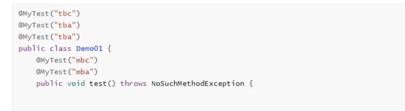
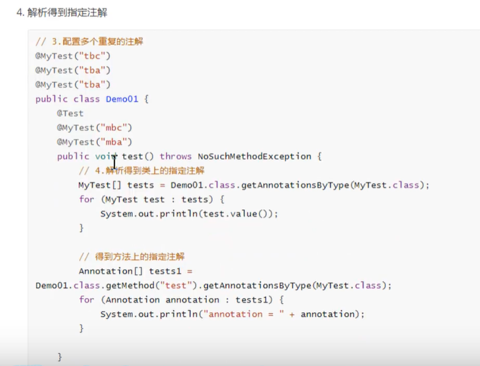

* 先前注解不能在同一个地方使用相同注解，jdk8进行改进

---

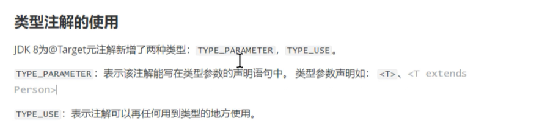
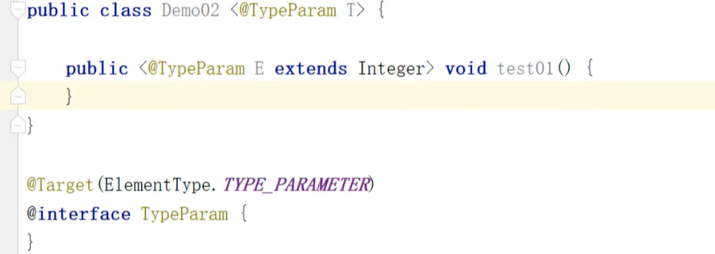
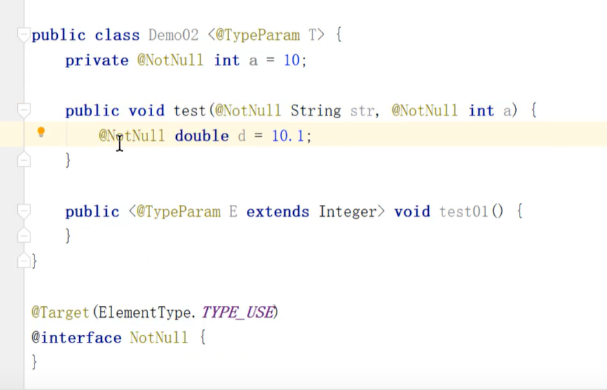

* `@Target`元注解新增了两种类型
  * `TYPE_PARAMETER`表示注解能放在泛型上
  * `TYPE_USE`注解可用于任何地方


# Stream扩展：boxed()


将基本类型流转换为对象流


```java
int arr[] = {1,2,3,4,5};
IntStream stream1 = Arrays.stream(arr);//通过Arrays工具类获取int[]的stream
Set<Integer> set1 = stream1.boxed().sorted(Comparator.reverseOrder()).collect(Collectors.toSet()); // boxed()相当于mapToObject

```


---

普通流转换成数值流

