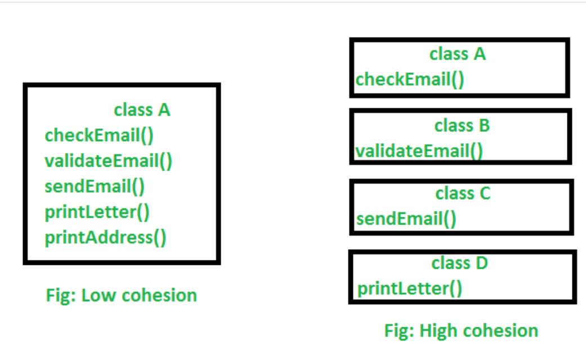

# 目标

- 生成CFG & 理解如何通过CFG得出程序的麦凯布循环复杂度 V(G) = E-N+2

- 理解软件度量如何实现 & 如何改进软件质量

- ``ckmetrics.jar``该依赖包用于JAVA类的CK度量.
  
  - 通过jar包中的 ``Apache Byte Code Engineering Library (BCEL)``API进行类分析

---

## 将项目打包成jar

- export project

- as runnable jar

---

## AE1

### Task

1. ``Controller.java``类的``initialiseVehicle``方法的绘制控制流图CFG.

2. 假定目标针对项目``VehicleControlSystem``
   - **提高``封装性，模块性``，减少``复杂度``**

   - 找出**3个相关metrics指标**可以用于测量该类的质量因素.

3. 找出``VehicleControlSystem``项目中**最需要被重组的类，**
   - 以达到**提高``封装性，模块性``，减少``复杂度``**
  
   - **用max 200字** 支持观点

4. **实现&提出4个因素达成以上类的重组**，以提高``Task 2``中提到的3个CKmetrics指标
   - 200字讨论如何通过重构**某类，提高``封装性，模块性``，减少``复杂度``**

5. 为重构后的新项目绘制新**类图**
   - 200字讨论实现后的新项目与原项目**任何结构上的差异**

---

## 提交

- ``pdf``格式
  
  - top包括``name & guid``
  
  - 文件包括``Task 1-5 solutions`` & ``相关截图`` & ``类图``

- 项目``VehicleControlSystem``**源码**, 包括重组后的实现类

- ``jar``
  
  - 实现重组后的新项目``jar``包

---

## :speech_balloon:封装性

隐藏内部逻辑复杂性，对外提供简单接口，不实现任何方法，只用于外部调用，提高可扩展性，维护性，封装性

>将类成员可见性设为private，对外提供set，get方法，不暴露私有成员

## 高内聚低耦合

> CBO, LCOM 等CK metrics 提高模块性，封装性相关

### :bento: 低耦合【CBO】

``例如: 方法A，B``
当A元素调用B元素，B元素不存在或出问题，修改的时候，A无法正常工作，或者需要修改A中大部分内容

- 称A，B tight coupled，**此时模块间独立性差，封装性，模块性差**

A,B之间存在依赖关系,如果B改变，A仍可以工作.

- A,B loose coupling，**此时模块间独立，方法复用性高，维护成本低，模块性封装性高，**

**:speech_balloon:高耦合解决办法**:

- 为类，元素之间提供接口，而不是继续采用继承. 继承就是一种耦合.

  - 假设A继承B，一旦B变更或不存在,A都需要被覆写&修改.

- 分层扩展，多态，接口的实现

---

### :bento:高内聚【small LCOM】

> 内聚: 模块内部的功能实现, 最好是功能无法拆分, 实现原子功能.

系统中存在A,B模块，修改A不影响B的工作，则认为A模块有高内聚.

- 某模块功能独立，**只实现该实现的功能，不参与其他功能的实现**

  - 低内聚: 某类功能过多, **没有focused该实现的部分(过多不必要方法)**

低内聚

- 类方法复杂度高

- 封装性，模块性低

:speech_balloon:**解决办法**

- **此时类可以分成多个子类来改进封装性**

- **并且每个子类实现该实现的业务功能，避免过多非共享字段出现在同一类中(无关方法)**

> high LCOM 可用于找出低质量类设计
