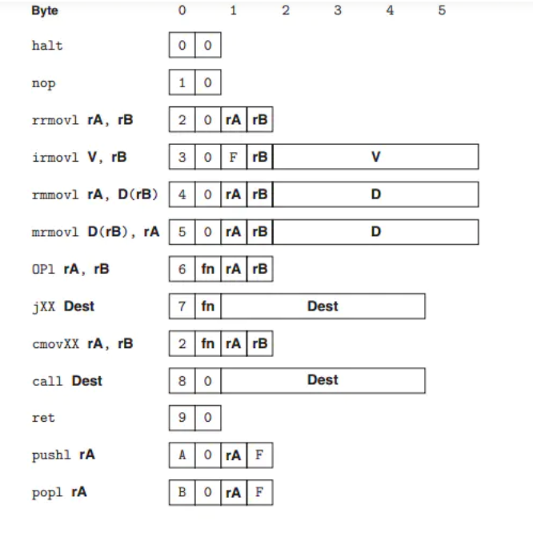
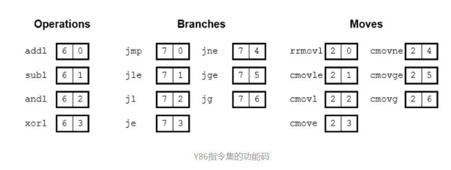
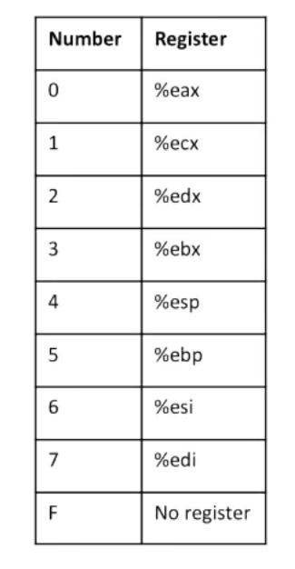
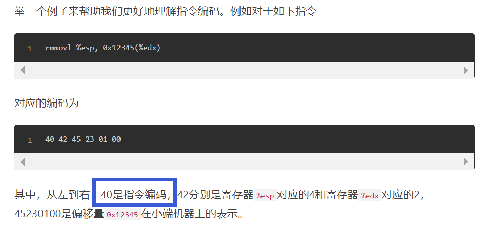

# 指令集架构相关

简易指令集

- 设计需要规定指令集和相应机器编码&汇编助记符

- 给每个指令划分步骤执行完成
  
  - 各个阶段尽量简单实现

- 将硬件设备结合适当逻辑电路实现自定义指令集

## 指令集&机器码

> 简易指令集不需要过多指令, 能**实现基本数据转移&控制流**

:bento:Y86(x86微架构采用的)指令集例子

- 所有指令&对应机器码

- 每个指令长度字节不同
  
  - **1字节**的高4位为指令编码,用于区别不同指令
  - 低4位为**0或fn(功能代码,不同操作)**
  
  

- 不同fn功能码,在1字节高4位不同指令码中有不同含义

  - 如运算指令: +,-,*,/
  
  - 分支跳转指令:不同跳转条件
  
  - 条件转移指令,不同转移条件.etc

---

:blue_heart:**第二个字节**

- 大部分指令来说,该字节存放寄存器标识符

---
例子

