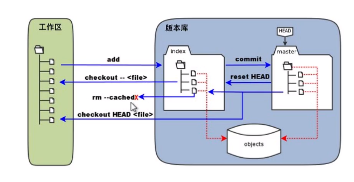
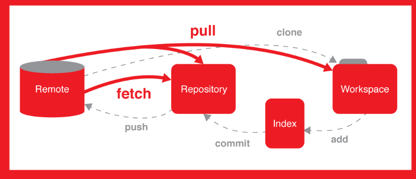

# 自用git指令
---
目录
-   ### [流程图](#流程图)
-   ### [删除相关](##删除相关)
    - ####  [恢复push前](#恢复push前)
    - ####  [恢复push后](#恢复push后)


---
#   流程图





## 删除相关 
>当需要删除index&工作区文件

```
//即 rm真实删除FS中文件后，向远程repo推送更新
git rm <filename>
git commit -m
git push
```

>当只需要删除index&远程repo中文件， 不接触本地FS

```
git rm --cached <filename>
git commit -m
git push
```

## 恢复文件
### 恢复push前
>假设此时有误删文件情况，
- 此时**都未进行**``git push``操作
  
  - **未进行**``git commit -m``

    ```
    可直接通过 git checkout <filename>进行文件恢复
    ```
  - **已进行** `git commit -m`
    ```
    通过 git reset (--hard) HEAD +<filename> 指令进行文件恢复

### 恢复push后
>此时已进行`git push`操作, 无法直接恢复。
>> **通过版本号退回**

    git reset -hard <sequence>


